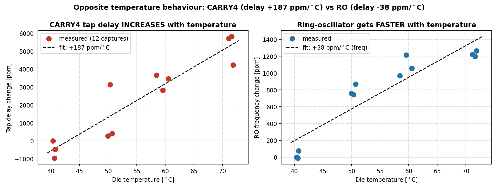
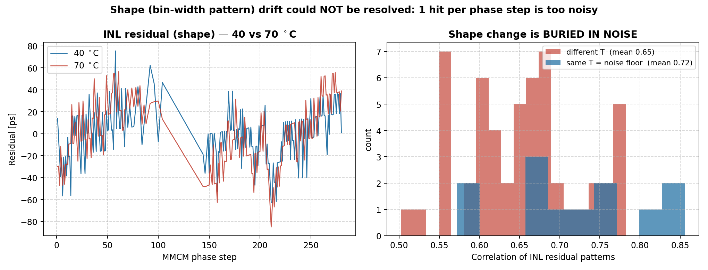

# 일일 작업 리포트 — 2026-07-28

> **작성일** 2026-07-28
> **작성** Claude Opus 5 (Claude Code) — 당일 작업 요약
> **측정** 사용자 (회사 온도조절기), `python/temp/` 16개 CSV
> **주의** AI가 생성한 문서입니다. 수치·절차는 실제 코드/측정과 대조하십시오.

---

## 0. 오늘의 한 줄 요약

온도 실험을 수행해 **"보정해야 할 양"을 처음으로 정량화**했다.
CARRY4 탭 지연은 **+187 ppm/°C로 느려지고**, 40→72 °C에서 클럭 한 주기(5 ns)에
**약 30 ps의 오차**가 쌓인다 — LSB(17 ps)의 1.7배다. **자동 보정이 필요하다는
근거가 우리 칩에서 확보됐다.**
반면 **bin 형상(폭 패턴)의 변화는 측정하지 못했다** — 측정 방법의 잡음이 너무 컸다.

---

## 1. 무엇을 어떻게 쟀나 (쉬운 설명)

### 재려는 것

TDC는 "자(ruler)"다. 눈금 하나가 탭 하나이고, 우리 자는 눈금이 약 17 ps다.
온도가 변하면 이 **눈금 간격이 변한다.** 두 가지를 알아야 한다.

| | 비유 | 무엇이 문제인가 |
|---|---|---|
| **스케일** | 자 전체가 늘어남/줄어듦 | 모든 측정에 **비례해서** 오차 발생 → 치명적 |
| **형상** | 눈금 사이 **간격 비율**이 바뀜 | 국소적 오차 (DNL) |

### 어떻게 쟀나

**온도에 안 변하는 기준자**가 필요하다. 그게 **MMCM 위상 시프트(DPS)** 다 —
크리스털 발진기에서 나오므로 온도에 안정적이고, **17.857 ps씩 정확히** 밀 수 있다.

```
DPS로 hit 도착 시각을 17.857 ps씩 밀면서  →  TDC가 몇 번째 탭이라고 답하는지 기록
        (알려진 참 시간)                          (측정값)

두 값의 기울기 = "참 시간 1 ps당 탭 몇 개인가" = 눈금 간격의 역수
```

온도가 올라 탭이 **느려지면**, 같은 시간에 **더 적은 탭**을 지나가므로 기울기가 **작아진다.**

**측정:** 40 / 50 / 60 / 70 °C 네 지점, 각 3회 반복 = **12회 캡처** (설정온도가 아니라
XADC 실측 다이온도 사용). 같은 비트스트림 유지(재합성 없음).

---

## 2. 결과 ① — CARRY4는 온도가 오르면 느려진다 ✅



**왼쪽 그래프**가 핵심이다. 점 12개가 우상향한다 = 온도가 오를수록 탭 지연이 커진다.

```
CARRY4 탭 지연 온도계수 :  +186.9 ppm/°C      상관 r = -0.93
40 °C → 72 °C          :  +5,981 ppm (0.60 %)
5 ns 전 구간 누적 오차   :  약 30 ps          ← LSB 17 ps의 1.7배
```

**이게 뜻하는 것:** 상온에서 교정한 TDC를 70 °C에서 그냥 쓰면, 5 ns 구간 측정에
**30 ps가 틀린다.** 우리 자가 0.6 % 늘어난 것이다.

> **신뢰도:** 31 °C 구간의 신호(5,981 ppm)가 산포(866 ppm)의 약 7배 → 확실한 추세.

### 오른쪽 그래프 — RO는 **반대로** 빨라진다

```
RO 주파수 : +37.6 ppm/°C  (즉 RO 지연은 -37.6 ppm/°C로 감소)
```

**부호가 반대다.** 왜 그런가:

> 저전압 CMOS에는 **역온도 의존(temperature inversion)** 이 있다. 온도가 오르면
> ① 이동도 감소(느려짐) ② 문턱전압 감소(빨라짐) 두 효과가 경쟁하는데, 어느 쪽이
> 이기는지가 **회로 구조마다 다르다.**
>
> - **CARRY4**(전용 캐리 MUX): 반전점이 낮음 → 40 °C 이상은 이미 "느려지는" 영역
> - **RO**(LUT + 일반 라우팅): 반전점이 높음 → 40~72 °C는 아직 "빨라지는" 영역

Korkan 2022가 캐리체인에서 *"29 °C까지 지연 감소, 39 °C 이상 증가"* 를 보고한 것과
**우리 측정(40 °C 이상에서 증가)이 정확히 일치**한다.

> **참고:** 로드맵 §2.2에 있던 "RO 주파수로 스케일을 추정한다"는 아이디어는 이로써
> **기각**된다(부호가 반대라 보정하면 오차가 2배가 됨). 다만 이는 곁가지였고,
> **RO의 본래 역할인 "랜덤 hit 소스"에는 아무 영향이 없다.** RO의 hit rate 변화는
> 30 °C에 걸쳐 0.12 %에 불과하고, 무상관성(07-26 검증)도 그대로다.

---

## 3. 결과 ② — 형상 변화는 **측정하지 못했다** ❌



### 무엇을 보려 했나

기울기(스케일)를 빼고 남는 **잔차 패턴**이 곧 bin 폭의 불균일 구조(INL)다.
온도별로 이 패턴을 비교하면 형상이 변했는지 알 수 있다.

### 왜 실패했나 — 대조군이 답을 줬다

```
같은 온도에서 3회 반복한 것끼리의 상관  :  평균 0.72   ← 잡음 바닥
서로 다른 온도끼리의 상관              :  평균 0.65
```

**두 값이 사실상 같다.** 온도를 30 °C 올린 효과가, **같은 온도에서 두 번 잰 것의
차이보다 크지 않다.** 즉 형상 변화가 있었더라도 잡음에 묻혀 보이지 않는다.

### 원인 — 위상 스텝당 hit이 **1개뿐**

현재 `capture_trigger`는 스텝마다 **딱 하나의 hit**만 저장한다. 그래서 각 점이
단일 측정이고, 양자화(±0.5 LSB ≈ ±8.5 ps)와 지터가 그대로 노출된다.

```
INL 자체 규모      : 26 ps
반복 간 차이(잡음)  : 17~21 ps      ← 신호와 잡음이 거의 같은 크기
3회 평균해도       : √3 개선뿐
```

**교훈:** 스케일(전체 기울기)은 217개 점을 한꺼번에 피팅하므로 잡음이 평균화되어
잘 나온다. 하지만 **형상은 점 하나하나가 필요**하므로 같은 데이터로는 안 된다.

---

## 4. 설계에 주는 의미

| 성분 | 드리프트 | 상태 | 대응 |
|---|---|---|---|
| **스케일** | **+187 ppm/°C** | ✅ 확정 | DPS 앵커로 주기적 재측정 (크리스털 기준) |
| **형상** | ? | ❌ 미측정 | **RO code density** — 갱신 주기 미정 |

**형상의 갱신 주기가 아키텍처의 마지막 미지수다.**

- 형상이 **온도에 둔감**하면 → RO는 **부팅 시 1회 + 유휴 시 천천히** 갱신
- 형상이 **민감**하면 → RO를 **상시** 돌려야 함

이 답에 따라 RO 하드웨어의 duty와 운용 방식이 결정된다.

---

## 5. 다음 온도 실험에서 할 것 — 방법을 바꿔야 한다

**Mode 1 히스토그램을 온도별로 추가 캡처.**

| | 오늘 (Mode 0 timestamp) | 다음 (Mode 1 히스토그램) |
|---|---|---|
| 점당 표본 | **1 hit** | **수십만 hit** |
| 잡음 | 17~21 ps | 무시 가능 |
| 형상 판정 | 불가 | 가능 |

절차: 온도마다 Mode 1 비트스트림으로 **재프로그래밍**(재합성 아님) → RO 히스토그램
2개(cal/val) 캡처 → 각 온도 히스토그램을 자기 평균으로 정규화해 겹쳐본다.
겹치면 형상 불변, 어긋나면 갱신 필요.

> XDC가 딜레이라인 배치를 고정하므로 Mode 0/Mode 1 두 빌드의 bin 특성은 거의 같다.
> 다만 주변 로직 배치는 다르므로, **형상 비교는 Mode 1 시리즈 내부에서만** 수행한다.

---

## 6. 파일 / 데이터

**측정 데이터 (`python/temp/`, gitignore 대상)**
```
ro_40degree.csv ~ ro_70degree.csv        RO 주파수 (1024 샘플씩)
tf_{40,50,60,70}degree_{a,b,c}.csv       전달함수 (스텝 214~217개씩)
```

**생성 그림 (`Markdown/fig/`)**
```
2026-07-28_temp_scale.png    스케일 드리프트 (좌: CARRY4, 우: RO)
2026-07-28_temp_shape.png    형상 분석 (좌: INL 잔차, 우: 상관 분포)
```

**측정 품질 메모**
- 12파일 모두 `capture_trigger` 유효, 공통 스텝 214개 확보
- `ro_meas_cnt`는 Mode 0(shifted 클럭)에서도 214~217/217개가 정상 → CDC 오염 미미
- 캡처 내 온도 변동 폭 1.4~2.0 °C (XADC 분해능 수준)
- CDC 결손 구간은 이 빌드에서도 존재(스텝 214개만 유효) — 예상대로이며 기울기 피팅에 무해

---

## 7. 실무 개선점 (다음 측정 전 반영)

1. **선형 COE 사용** — 스케일 측정 시 `fine_ps = idx × 15.625`가 되어 **탭 인덱스를
   정확히 역산** 가능. 현재는 구버전 비선형 COE라 LUT의 INL이 잔차에 섞여 캡처당
   정밀도가 ±900 ppm에 머물렀다.
2. **2점 앵커 검토** — 전 구간 스윕(217점) 대신 두 위상점에서 다수 hit을 평균하면,
   INL 탈상관 없이 수십 ppm 정밀도가 가능할 것으로 예상.
3. **형상은 히스토그램으로** — timestamp 경로로 형상을 보려 하지 말 것.

---

## 8. 로드맵 반영

`Paper_Roadmap.md` 갱신 (§1.4 신설, §2.2·§2.4 수정):
- **§2.2(RO 스케일 프록시) — 측정으로 기각.** 선행연구가 아니라 **우리 데이터**로 부정
- **§2.4 융합 교정** — '추적' 단계의 감시자를 RO → **XADC 트리거 + DPS 앵커**로 변경
- 실측 자산에 **+187 ppm/°C** 추가 (보정 필요성의 정량 근거)

---

## 9. 미결정 사항

1. **형상의 온도 의존성** ← 다음 실험의 목표. 아키텍처 확정의 전제
2. **2점 앵커 정밀도** — 실제로 수십 ppm이 나오는지 검증 필요
3. **hit-shift 구조 전환** (클럭 대신 hit을 미는 방식) — 한 빌드에서 3모드 운용 +
   Mode 0 CDC 버그 소멸. 온도 실험이 일단락되면 적용
4. T15 정밀 재조사 — §2.4/§2.5 신규성 확정
