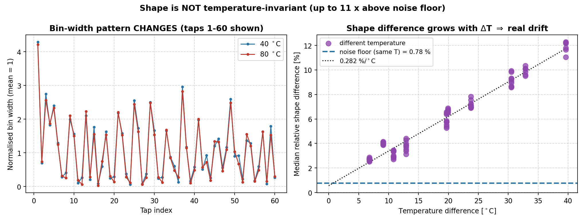
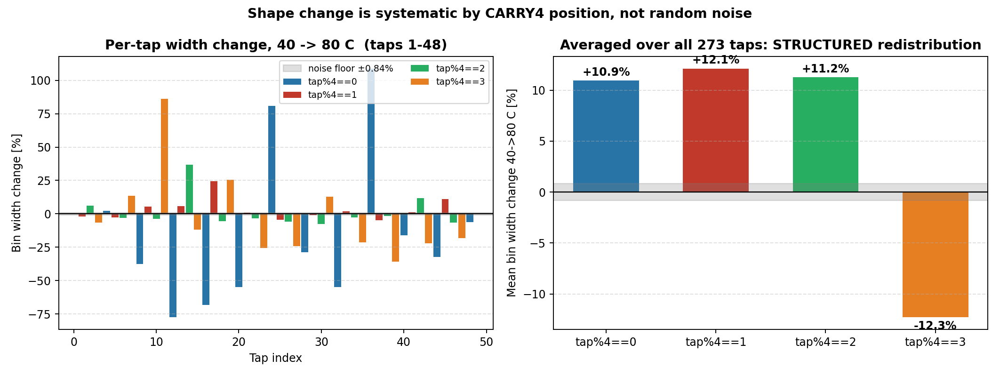
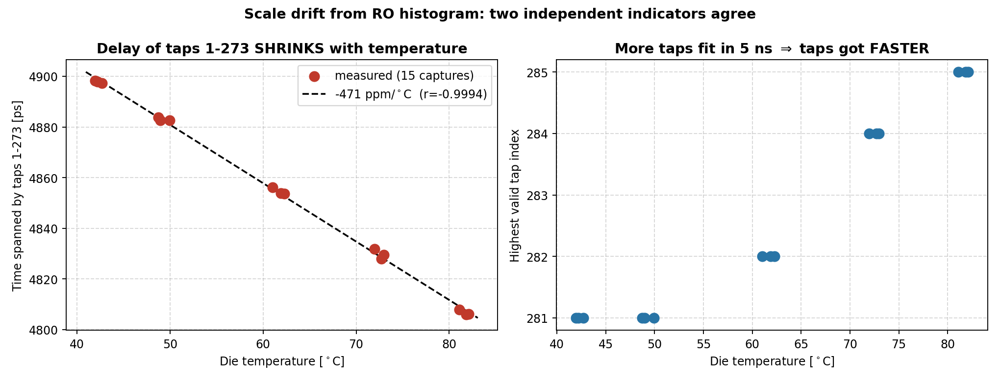

# 일일 작업 리포트 — 2026-07-29

> **작성일** 2026-07-29
> **작성** Claude Opus 5 (Claude Code) — 당일 작업 요약
> **측정** 사용자 (회사 온도조절기), `python/histo_temp/` 15개 CSV
> **수정** 2026-07-29 21:20 — 계산 정의 추가: §2-0 형상 차이(정규화·중앙값·워크드 예제),
> §2 period-4 산출식, §3 스케일 지표 A(구간시간 공식)·B(유효 최대 탭)
> **주의** AI가 생성한 문서입니다. 수치·절차는 실제 코드/측정과 대조하십시오.

---

## 0. 오늘의 한 줄 요약

**형상(bin 폭 패턴)은 온도 불변이 아니다.** 40→80 °C에서 형상이 **11.9 % 변하고**,
이는 잡음 바닥(0.8 %)의 **15배**다. 변화는 무작위가 아니라 **CARRY4 위치별로 구조적**
이다(`tap%4==3`만 −12 %, 나머지 +11 %).

동시에 **스케일 부호가 어제 결과와 정반대**로 나왔다. 이 상충은 **미해결**이며, 내일
결정적 실험으로 판정한다.

---

## 1. 무엇을 어떻게 쟀나

어제(Mode 0 전달함수)는 **위상 스텝당 hit이 1개뿐**이라 잡음이 신호를 덮어 형상을
측정하지 못했다. 그래서 오늘은 **Mode 1 히스토그램**으로 방법을 바꿨다.

| | 어제 (Mode 0) | 오늘 (Mode 1) |
|---|---|---|
| 자극 | DPS 위상 스윕 (결정론) | Ring Oscillator (랜덤) |
| 점당 표본 | **1 hit** | **약 23만 hit** |
| 총 hit | 약 2,600개 | **약 9.8억 개** |
| 측정 원리 | 스텝당 눈금 이동 (∝ 1/τ) | 눈금별 hit 수 (∝ τ) |

**code density 원리:** 랜덤 hit이 클럭 주기를 고르게 훑으므로, **탭 i에 떨어진 hit 수는
그 탭의 폭에 비례**한다. 폭을 직접 재는 셈이다.

**측정:** 40 / 50 / 60 / 70 / 80 °C 각 3회 = **15 캡처**, 동일 비트스트림.

### 캡처 요약

| 파일 | 다이온도 [°C] | 총 hit | 유효 최대 탭 |
|---|---|---|---|
| histo_40_1/2/3 | 41.96 / 42.20 / 42.70 | 6.43 / 6.44 / 6.31 e7 | 281 |
| histo_50_1/2/3 | 48.72 / 48.97 / 49.96 | 6.49 / 6.79 / 6.45 e7 | 281 |
| histo_60_1/2/3 | 61.03 / 61.89 / 62.26 | 6.53 / 6.48 / 6.55 e7 | **282** |
| histo_70_1/2/3 | 71.98 / 72.96 / 72.72 | 6.52 / 6.44 / 6.71 e7 | **284** |
| histo_80_1/2/3 | 81.08 / 81.82 / 82.07 | 6.59 / 6.52 / 6.52 e7 | **285** |

> `histo_80_1`은 이상치다(80 °C 반복 중 2-3은 0.63 % 차이인데 1-2, 1-3은 약 3 %).
> 첫 캡처라 열평형이 덜 됐을 가능성. **잡음 바닥 계산에서 제외**했다.

---

## 2. ★ 결과 ① — 형상은 온도에 따라 변한다 (확정)

### 2-0. "형상 차이"의 정의 — 어떻게 계산했나

#### 1단계: 정규화 (스케일·누적시간 제거)

원시 히스토그램 `h[i]`(탭 i의 hit 수)를 **자기 평균으로 나눈다.**

$$\text{shape}[i] = \frac{h[i]}{\text{mean}(h[1..273])}$$

이 한 번으로 두 가지가 동시에 제거된다:
- **누적 시간 차이** (캡처마다 총 hit 수가 다름)
- **전체 스케일 드리프트** (온도로 모든 탭이 같이 변한 성분)

남는 것은 **탭들 사이의 폭 비율 = 형상**뿐이다. (정규화 후 평균은 정확히 1이 된다.)

#### 2단계: 탭별 상대 차이

두 캡처 A, B에 대해 탭마다:

$$d[i] = \frac{|\text{shape}_A[i] - \text{shape}_B[i]|}{\bigl(\text{shape}_A[i] + \text{shape}_B[i]\bigr)/2} \times 100\ \%$$

#### 3단계: 273개 탭의 **중앙값**

$$\text{형상 차이} = \text{median}\bigl(d[1], d[2], \dots, d[273]\bigr)$$

> **왜 평균이 아니라 중앙값인가:** 분포가 심하게 치우쳐 있다. 실측(40 °C vs 80 °C)에서
> **중앙값 12.3 %, 평균 23.9 %, 최대 140.7 %** 다. 폭이 좁은 탭은 hit이 적어 상대 변동이
> 원래 크기 때문에, 평균은 소수의 극단값에 끌려간다. 중앙값이 전형적인 변화를 대표한다.

#### 실제 계산 예 (40 °C `histo_40_1` vs 80 °C `histo_80_2`)

| tap | h(40 °C) | h(80 °C) | shape₄₀ | shape₈₀ | d[i] |
|---|---|---|---|---|---|
| 5 | 551,296 | 535,142 | 2.389 | 2.332 | 2.41 % |
| 6 | 295,682 | 285,883 | 1.281 | 1.246 | 2.80 % |
| 7 | 63,120 | 72,262 | 0.273 | 0.315 | 14.07 % |
| 8 | 94,252 | 57,980 | 0.408 | 0.253 | **47.12 %** |
| 9 | 458,650 | 483,617 | 1.987 | 2.107 | 5.87 % |
| 10 | 358,256 | 344,873 | 1.552 | 1.503 | 3.24 % |
| 11 | 23,064 | 42,567 | 0.100 | 0.185 | **59.95 %** |
| 12 | 60,961 | 13,390 | 0.264 | 0.058 | **127.63 %** |

```
총 hit    : 40 °C 6.301e7 ,  80 °C 6.265e7   (서로 다름 — 정규화로 소거)
평균 h    : 40 °C 230,798 ,  80 °C 229,494
shape 평균: 40 °C 1.0000  ,  80 °C 1.0000    <- 정규화 확인
273개 탭 d[i] : 중앙값 12.28 %  (이 값이 표에 실린 수치)
```

**넓은 탭(5, 6, 9, 10)은 2~6 %인데 좁은 탭(8, 11, 12)은 47~128 %** 로 크게 변한다.
좁은 탭이 특히 민감하다는 뜻이며, §2의 period-4 구조와 일치한다.

#### 잡음 바닥은 같은 식으로 계산

**같은 온도의 두 캡처**에 대해 위 3단계를 그대로 적용한 값이다. 측정 조건이 동일하므로
그 차이는 순수 잡음이고, 이것이 비교 기준선이 된다.

#### Poisson 기대치 (참고)

계수 통계만으로 예상되는 차이:

$$\text{Poisson} = \text{median}\left(\sqrt{\tfrac{1}{h_A[i]} + \tfrac{1}{h_B[i]}}\right) \times 100\ \%$$

실측 **0.33 %**. 잡음 바닥(0.78 %)이 이보다 2~3배 큰 것은 이전에도 관찰된 초과 변동이다.

---



### 오른쪽 그래프가 핵심

가로축이 **두 캡처의 온도차**, 세로축이 **형상 차이**다. 점들이 **직선 위에 올라간다.**

```
잡음 바닥 (같은 온도 반복끼리)  :  0.78 %      ← 파란 점선
40 → 80 °C 형상 차이            : 11.9 %      ← 15배
드리프트율                      :  0.282 %/°C
```

**온도차가 클수록 형상 차이가 비례해서 커진다.** 잡음이라면 온도차와 무관해야 하는데
그렇지 않다. **실제 드리프트다.**

| 온도쌍 | ΔT [°C] | 형상 차이 | 잡음 대비 |
|---|---|---|---|
| 40–50 | 6.8 | 2.70 % | 2.5× |
| 40–60 | 19.7 | 5.89 % | 5.5× |
| 40–70 | 30.5 | 9.14 % | 8.5× |
| **40–80** | **39.6** | **11.64 %** | **10.9×** |
| 60–70 | 10.8 | 3.11 % | 2.9× |
| 70–80 | 9.1 | 3.82 % | 3.6× |

> 어제는 잡음 바닥(0.72)과 온도간(0.65)이 **겹쳐서** 판정 불가였다. 오늘은 통계가
> 38만 배 많아 명확히 갈린다.

### 그리고 변화가 무작위가 아니다 — 구조적 재분배



**계산:** 각 온도의 3회 캡처를 평균한 `shape`를 40 °C 기준과 비교해 **부호 있는**
상대 변화를 구하고(§2-0의 `d[i]`는 절댓값이지만 여기서는 부호를 유지),

$$\text{rel}[i] = \frac{\text{shape}_T[i] - \text{shape}_{40}[i]}{\text{shape}_{40}[i]} \times 100\ \%$$

이를 **`tap % 4` 잔여류별로 평균**한다. CARRY4 내부 위치(`tap % 4`)별로 갈라진다:

| 40 → 80 °C | tap%4==0 | tap%4==1 | tap%4==2 | **tap%4==3** |
|---|---|---|---|---|
| 평균 폭 변화 | **+10.9 %** | **+12.1 %** | **+11.2 %** | **−12.3 %** |

잡음 바닥이 ±0.84 %인데 **10배 이상 벗어난다.** 무작위라면 네 값이 0 근처에 모여야
한다. **CARRY4 안에서 네 번째 위치의 폭이 나머지로 옮겨간다.**

온도에 따라 단조롭게 진행된다:

| 40 °C 대비 | %4==0 | %4==1 | %4==2 | %4==3 |
|---|---|---|---|---|
| 50 °C | −1.6 | +2.1 | +1.1 | −2.9 |
| 60 °C | −1.8 | +6.4 | +4.6 | −6.3 |
| 70 °C | +2.3 | +9.5 | +8.4 | −10.6 |
| 80 °C | +10.5 | +11.9 | +11.1 | −12.1 |

### 이게 뜻하는 것

> **Pan 2014의 "형상 불변" 가정과 Won 2016의 "tendency almost unchanged" 관찰이
> 본 칩에서는 성립하지 않는다.**

다만 절대량으로는 크지 않다:

| ΔT | 형상 오차 | DNL 환산 (bin 17 ps 기준) |
|---|---|---|
| 10 °C | 2.8 % | 약 0.03 LSB |
| 40 °C | 11.9 % | 약 0.12 LSB |

**스케일 보정만으로는 제거되지 않는 성분**이므로, RO 형상 갱신이 필요하다는 설계
근거가 된다. 동시에 변화가 **구조적(period-4)** 이라 소수 파라미터로 모델링할 여지가
있다 — 이 점이 오히려 신규성 후보가 될 수 있다.

---

## 3. ⚠️ 결과 ② — 스케일 부호가 어제와 정반대 (미해결)



### 오늘 측정 — 두 지표가 일치

#### 지표 A: 고정 탭 구간이 차지하는 시간

랜덤 hit은 클럭 한 주기(5000 ps)를 고르게 훑으므로,

$$\frac{h[i]}{H} = \frac{w_i}{5000\ \text{ps}} \qquad (H = \text{총 hit},\ w_i = \text{탭 } i \text{ 의 폭})$$

따라서 **고정 구간(탭 1~273)의 절대 시간**을 크리스털 클럭 기준으로 얻을 수 있다:

$$\text{span} = 5000 \times \frac{\sum_{i=1}^{273} h[i]}{H}\ \ [\text{ps}]$$

> 상한을 273으로 고정한 이유: 전 온도에서 확실히 유효한 범위여야 같은 물리량을
> 비교할 수 있다(유효 상한이 281~285로 온도마다 다름).

```
42 °C → 4898.2 ps        82 °C → 4806.1 ps
탭 평균 폭 17.94 ps  →  17.61 ps
탭 지연 온도계수 = −470.8 ppm/°C    r = −0.9994
```

#### 지표 B: 유효 최대 탭 인덱스 (모델 없음)

hit이 도달한 가장 높은 탭 번호. 판정 기준은 §1의 유효 구간 검출과 동일
(0이 아닌 탭 평균의 5 % 이상).

```
42 °C → 281        82 °C → 285
```

**한 주기에 더 많은 탭이 들어감 = 탭이 좁아짐(빨라짐).**
LUT도, 위상 스텝도, 회귀도 거치지 않는 **직접 관측**이라 가장 신뢰도가 높다.

두 지표가 **같은 방향·비슷한 크기**를 가리킨다(지표 B는 정수 양자화라 ±3,600 ppm 단위).

### 어제와의 충돌

| | 어제 (Mode 0) | 오늘 (Mode 1) |
|---|---|---|
| 탭 지연 온도계수 | **+189 ppm/°C** (느려짐) | **−471 ppm/°C** (빨라짐) |
| 상관 | r = −0.93 | r = −0.9994 |

**부호가 반대다.** 검증한 것:

- 어제 데이터를 **짝지은 회귀 없이** 단순히 "스텝당 fine 증가"로 다시 계산해도
  같은 결과(−189 ppm/°C in ps/step) → **분석 방법 탓이 아니다**
- DPS 기준자는 정상 (280 스텝 × 17.857 = 5000 ps, 실측 4964 ps로 확인)
- COE는 완전 선형(`tdc_calib_mode0_rom.coe`, 스텝 15.624, 최대 4984) → **래핑 없음**

> **정정:** 어제 리포트에서 "COE 래핑 때문"이라고 추정했던 설명은 **틀렸다.**
> 원인은 아직 모른다.

### 부수 발견 — 절대 탭폭도 안 맞는다

| 출처 | 탭폭 |
|---|---|
| 어제 전달함수 (LUT 스텝 15.625 가정) | 15.76 ps |
| 오늘 히스토그램 | 17.9 ps |

14 % 차이. 어제 `fine_ps` 최댓값 4893 ps를 15.625로 나누면 tap 313이 되는데,
히스토그램상 유효 탭은 281개뿐이라 **모순**이다. LUT 스텝이 실제로는 ~17.7이라면
양쪽이 들어맞는다 → **ROM IP가 참조하는 COE 파일 확인 필요.**

---

## 4. 설계에 주는 의미

| 성분 | 상태 | 대응 |
|---|---|---|
| **형상** | ✅ **온도에 변함 (0.28 %/°C)** | RO 형상 갱신 필요 — "부팅 1회"로 불충분 |
| **스케일** | ⚠️ **부호 상충, 미해결** | 판정 후 결정 |

형상 결과만으로도 아키텍처 방향은 정해진다: **RO를 유휴 시간에 지속적으로 돌려
형상을 갱신하는 설계가 정당화된다.**

---

## 5. 내일(2026-07-30) 할 것

### 🔴 최우선 — 스케일 부호 판정 (결정적 실험)

**한 빌드에서 두 경로를 모두 측정해 직접 비교한다.**

Mode 0 빌드에서도 히스토그램은 스윕 중에 누적된다
(`gated_ts_valid = final_ts_valid && ps_busy_sync_d2`). 따라서 **Mode 0 빌드 하나로
전달함수와 히스토그램을 둘 다** 얻을 수 있다.

**절차 (온도 2점이면 충분: 40 °C, 80 °C)**

1. **Mode 0 빌드** (`OPERATION_MODE = 0`). 재합성은 이 1회만
2. 각 온도에서 **열평형 대기**
3. **캡처 A — 전달함수**
   - Capture mode `BASIC`, 자격저장 `probe0 (capture_trigger) == 1`
   - Trigger `probe0 == 1`, depth 1024
   - arm → `btn_shift` → 카운트 멈추면 정지 → export
4. **캡처 B — 히스토그램** (같은 스윕 직후, 리셋하지 말 것)
   - Capture mode `ALWAYS`, Trigger `probe1 (readout_active) == 1`, depth 1024
   - arm → `btn_shift` → 자동 캡처 → export

**파일명**
```
mix_T40_tf.csv    mix_T40_histo.csv
mix_T80_tf.csv    mix_T80_histo.csv
```

**판정 기준 — 모델을 안 거치는 지표 하나로 결정**

> **히스토그램의 유효 최대 탭 인덱스**가 40 → 80 °C에서
> - **늘어남** → 탭이 빨라짐 → **오늘(Mode 1)이 맞음**
> - **줄어듦** → 탭이 느려짐 → **어제(Mode 0)가 맞음**

같은 빌드·같은 스윕이므로 빌드 차이 변수가 제거된다.

> ⚠️ Mode 0 히스토그램은 DPS 자극이라 **형상은 편향**되지만(2026-07-23 T1에서 확인),
> **최대 도달 탭**은 편향과 무관한 robust 지표다. 이 실험은 스케일 판정 전용이다.

### 🟠 부수 — ROM IP가 참조하는 COE 확인

Vivado IP Sources → `tdc_calib_rom` → Re-customize → COE 파일 경로 확인.
§3의 14 % 탭폭 불일치를 즉시 해소할 수 있다.

### 🟢 여유 있으면 — 형상 데이터 보강

오늘 `histo_80_1`이 이상치였다. 80 °C만 2~3회 재캡처하면 잡음 바닥이 깨끗해진다.

---

## 6. 파일

**측정 데이터** (`python/histo_temp/`, gitignore 대상)
```
histo_{40,50,60,70,80}_{1,2,3}.csv     각 320행, 총 hit 약 6.5e7
```

**생성 그림** (`Markdown/fig/`)
```
2026-07-29_histo_scale.png          스케일 (구간시간 + 유효탭수)
2026-07-29_histo_shape.png          형상 드리프트 (ΔT 비례성)
2026-07-29_histo_shape_detail.png   period-4 구조적 재분배
2026-07-29_histo_period4.png        온도별 period-4 추이
```

**측정 품질**
- 15파일 모두 `readout_active` 320행 정상, 주소 0~317 단조
- 같은 온도 반복 차이 0.63~0.99 % (Poisson 기대 0.33 % 대비 2~3배 — 기존 관찰과 일치)
- `histo_80_1` 이상치 1건

---

## 7. 미결정 사항

1. **스케일 부호** ← 내일 결정적 실험. 아키텍처의 스케일 앵커 설계가 여기 달림
2. **ROM에 실제 로드된 COE** — 절대 탭폭 14 % 불일치의 원인
3. **형상 드리프트의 모델링 가능성** — period-4 재분배가 소수 파라미터로 기술되는가
   (되면 신규성 후보, 안 되면 전체 형상 갱신 필요)
4. 어제 리포트 §2·그림 1의 스케일 부호 — 내일 판정 후 정정 또는 확정
