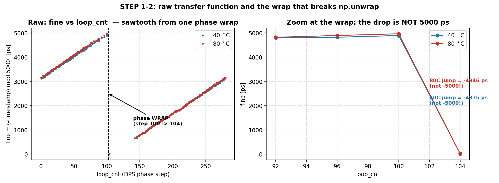
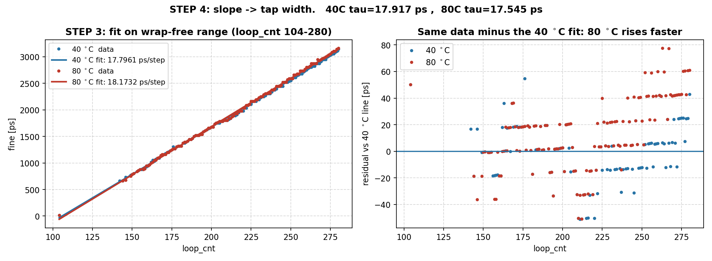
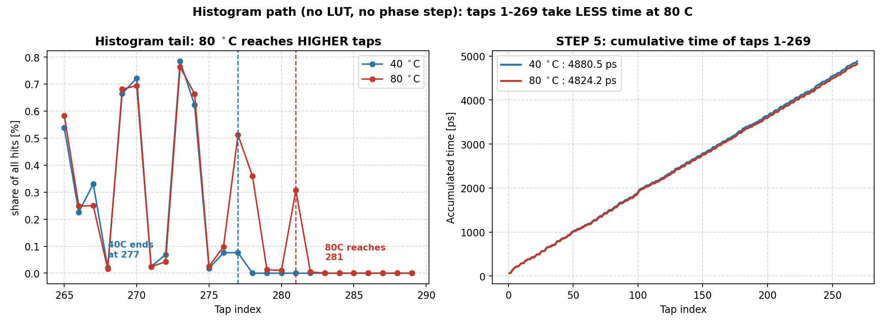
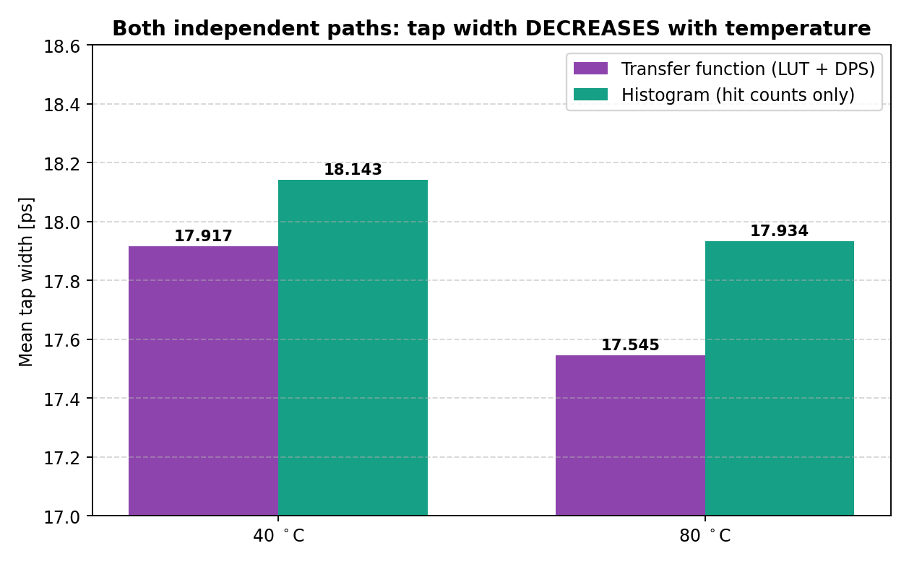

# 일일 작업 리포트 — 2026-08-03

> **작성일** 2026-08-03
> **작성** Claude Opus 5 (Claude Code) — 당일 작업 요약
> **측정** 사용자, `python/mix_t{40,80}_{tf,histo}.csv` + `python/dummy_rom.coe`
> **주의** AI가 생성한 문서입니다. 수치·절차는 실제 코드/측정과 대조하십시오.

---

## 0. 오늘의 한 줄 요약

7/28(전달함수)과 7/29(히스토그램)가 **탭 지연의 온도 방향에서 정반대**였던 문제를,
**같은 빌드·같은 온도에서 두 경로를 동시에 측정**해 판정했다.

**결론: 탭 지연은 온도가 오르면 감소한다(빨라진다).**
7/28의 `+187 ppm/°C(느려짐)`는 **오류**였고, 원인은 **분석 코드의 `np.unwrap` 주기
가정 오류**였다. 하드웨어 문제가 아니다.

---

## 1. 측정 구성

| 파일 | 내용 |
|---|---|
| `dummy_rom.coe` | ROM에 로드된 LUT (선형) |
| `mix_t40_tf.csv` / `mix_t80_tf.csv` | 전달함수 (timestamp vs loop_cnt) |
| `mix_t40_histo.csv` / `mix_t80_histo.csv` | 히스토그램 (탭별 hit 수) |

**같은 비트스트림, 같은 온도 지점(약 41 °C / 80 °C)에서 두 경로를 모두 캡처**했다.
7/28은 Mode 0 빌드, 7/29는 Mode 1 빌드였으므로 빌드 차이라는 변수가 있었는데,
이번에는 그 변수가 제거된다.

---

## 2. 전달함수 경로 — 원리부터 수식까지

### 2-1. 하드웨어가 만드는 값

`tdc_timestamp_calc.v`의 연산은 다음과 같다.

$$\text{timestamp} = \text{coarse} \times 5000 - \text{LUT}[\text{idx}]$$

- `coarse` : 클럭 사이클 카운터 (5 ns 단위)
- `idx` : 딜레이라인이 보고한 탭 번호 (popcount 결과)
- `LUT[·]` : ROM에 로드된 보정 테이블

### 2-2. coarse 성분 제거

우리가 원하는 것은 `idx` 정보뿐이므로 coarse를 없앤다. 양변에 −1을 곱하고 5000으로
나머지를 취하면:

$$\text{fine} \equiv (-\text{timestamp}) \bmod 5000 = \bigl(-\text{coarse}\times 5000 + \text{LUT}[\text{idx}]\bigr) \bmod 5000 = \text{LUT}[\text{idx}]$$

`coarse × 5000`은 5000의 배수라 나머지 연산에서 **완전히 사라진다.**

> 단, 이 식은 `LUT[idx] < 5000`일 때만 성립한다. 이번 데이터는 도달 최대 탭이 274~278로
> `LUT[278] = 4964 < 5000`이므로 조건을 만족한다.

### 2-3. LUT 상수 확인

`dummy_rom.coe`의 실제 값:

```
LUT[0..9] = 0, 18, 36, 54, 71, 89, 107, 125, 143, 161      ← 등간격
LUT 스텝  L = (LUT[319] − LUT[0]) / 319 = (5696 − 0)/319 = 17.8558 ps/tap
```

**선형**이므로

$$\text{LUT}[\text{idx}] = L \cdot \text{idx}, \qquad L = 17.8558\ \text{ps}$$

$$\Rightarrow\ \boxed{\ \text{fine} = L \cdot \text{idx}\ }$$

### 2-4. 원시 데이터 확인

`mix_t40_tf.csv`에서 `capture_trigger == 1`인 행:

| loop_cnt | timestamp_ps | fine = (−ts) mod 5000 | idx = fine / 17.8558 |
|---|---|---|---|
| 1 | 11,086,864,311,875 | 3125.0 | **175.01** |
| 2 | 11,096,864,361,839 | 3161.0 | **177.03** |
| 51 | 11,586,868,060,964 | 4036.0 | **226.03** |
| 53 | 11,606,868,210,911 | 4089.0 | **229.00** |

`idx`가 **정수 근처**(175.01, 177.03, 226.03, 229.00)로 떨어진다. LUT 스텝 17.8558이
맞다는 확인이다. (탭 번호는 정수여야 하므로)

### 2-5. DPS가 idx를 밀어내는 원리

MMCM 위상 시프트는 한 스텝마다 샘플링 클럭을 정확히

$$P = \frac{1000}{56} = 17.857\ \text{ps}$$

만큼 지연시킨다(VCO 1 GHz 기준, 크리스털에 잠겨 있어 온도에 안정).

클럭이 늦어지면 hit이 딜레이라인을 **그만큼 더 진행한 뒤** 샘플된다. 탭 하나의 폭을
$\tau$라 하면, 한 스텝당 추가로 지나가는 탭 수는

$$\Delta\text{idx} = \frac{P}{\tau}\ \ [\text{tap/step}]$$

### 2-6. 최종 관계식

2-3과 2-5를 합치면 스텝당 `fine` 증가량은

$$k \equiv \frac{d(\text{fine})}{d(\text{loop\_cnt})} = L \cdot \frac{P}{\tau}$$

$$\Rightarrow\ \boxed{\ \tau = \frac{L \cdot P}{k} = \frac{17.8558 \times 17.857}{k}\ }$$

> **핵심: $\tau$와 $k$는 반비례다.** 기울기가 크면 탭이 좁다(빠르다).
> 탭이 좁을수록 같은 시간에 더 많은 탭을 지나가므로 당연하다.

---

## 3. ⚠️ 여기서 함정 — 위상 랩



### 3-1. 왜 랩이 생기나

스윕은 280 스텝 × 17.857 ps = **정확히 한 클럭 주기(5000 ps)** 를 덮는다. 위상이 한
주기를 넘어가는 순간, hit은 **다음 클럭 엣지**에 잡히므로 `idx`가 최대에서 0으로
급락한다.

왼쪽 그림의 톱니가 그것이다. **loop_cnt 100 → 104 사이에서 한 번** 일어난다.

> 그림 왼쪽에서 104 이후 ~140까지 데이터가 비어 있는 것은 별개의 **CDC 결손 구간**이다
> (`current_loop_cnt` 미동기화, 기존 알려진 버그). 기울기 피팅에는 무해하다.

### 3-2. 랩의 크기가 5000이 아니다 ← 이것이 오류의 원인

오른쪽 확대 그림의 실측값:

| | 랩 직전 fine | 랩 직후 | **실제 낙차** |
|---|---|---|---|
| 41 °C | 4893 (step 100) | 18 (step 104) | **−4875 ps** |
| 80 °C | 4964 (step 100) | 18 (step 104) | **−4946 ps** |

**낙차가 5000이 아니다.** 이유는 명확하다 — 랩 직전의 `fine`은 **도달 가능한 최대 탭의
LUT 값**이지 5000이 아니기 때문이다.

$$\text{낙차} = L \cdot \text{idx}_{\max} = \begin{cases} 17.8558 \times 274 = 4893 & (41\ ^\circ\text{C}) \\ 17.8558 \times 278 = 4964 & (80\ ^\circ\text{C})\end{cases}$$

### 3-3. 내가 저지른 버그

7/28·7/29 분석에서 나는 이렇게 썼다:

```python
u = np.unwrap(f/5000*2*np.pi)/(2*np.pi)*5000     # ← 주기를 5000으로 가정
```

`np.unwrap`은 랩을 만나면 **5000을 더해** 이어 붙인다. 그런데 실제 낙차는 4875 / 4946
이므로 **과보정**이 발생한다.

| | 실제 낙차 | unwrap이 더한 값 | **오차** |
|---|---|---|---|
| 41 °C | 4875 | 5000 | **+125 ps** |
| 80 °C | 4946 | 5000 | **+54 ps** |

**그리고 이 오차가 온도마다 다르다.** 온도가 오르면 탭이 좁아져 더 높은 탭까지 도달하고
(274 → 278), `LUT[idx_max]`가 5000에 가까워져 오차가 줄어든다.

랩 이후의 모든 점이 그만큼 위로 밀리므로, 이 **온도 의존적 계단**이 직선 피팅의 기울기에
실려 **부호를 뒤집었다.**

### 3-4. 해결 — 랩을 건너뛴다

랩 이후의 **연속 구간에서만** 피팅한다. 두 온도 모두 랩이 같은 위치(step 100→104)에
있으므로, **공통 구간 `loop_cnt 104 ~ 280`** 을 쓴다. `np.unwrap`을 아예 쓰지 않는다.

---

## 4. 전달함수 결과



### 4-1. 직선 피팅

공통 구간 `loop_cnt ∈ [104, 280]`:

| | 점 수 | 피팅 결과 | 기울기 $k$ |
|---|---|---|---|
| 41 °C | 135 | fine = **17.7961** × loop_cnt − 1882.9 | 17.7961 ps/step |
| 80 °C | 133 | fine = **18.1732** × loop_cnt − 1950.4 | 18.1732 ps/step |

오른쪽 그림은 두 데이터에서 **41 °C 직선을 뺀 잔차**다. 80 °C 점들이 우상향한다 =
**기울기가 더 크다.**

### 4-2. 탭 폭 환산

$$\tau = \frac{17.8558 \times 17.857}{k}$$

$$\tau_{41} = \frac{318.86}{17.7961} = 17.9171\ \text{ps} \qquad
\tau_{80} = \frac{318.86}{18.1732} = 17.5453\ \text{ps}$$

$$\frac{\Delta\tau}{\tau} = \frac{17.5453 - 17.9171}{17.9171} = -20{,}751\ \text{ppm}
\ \Rightarrow\ \frac{-20{,}751}{38\ ^\circ\text{C}} = \mathbf{-546\ ppm/^\circ C}$$

**탭이 빨라진다.**

---

## 5. 히스토그램 경로 — LUT도 DPS도 쓰지 않는다



### 5-1. 원리

Ring Oscillator hit은 클럭 주기를 **고르게** 훑는다(2026-07-26 무상관성 검증 완료).
따라서 탭 $i$에 떨어지는 hit 수는 그 탭의 **시간 폭에 비례**한다:

$$\frac{h[i]}{H} = \frac{w_i}{5000\ \text{ps}} \qquad (H = \textstyle\sum_i h[i])$$

양변에 5000을 곱하고 구간 합을 취하면, **그 구간이 차지하는 절대 시간**이 나온다:

$$\text{span}(1..N) = 5000 \times \frac{\sum_{i=1}^{N} h[i]}{H}\ \ [\text{ps}]$$

기준자는 **클럭 주기 5000 ps**(크리스털)뿐이다. LUT도 위상 스텝도 개입하지 않는다.

### 5-2. 실제 계산

$N = 269$로 고정한다(두 온도 모두 확실히 유효한 범위 — 유효 상한이 277/281로 다르므로
공통 구간을 써야 같은 물리량을 비교할 수 있다).

| | $\sum_{i=1}^{269} h[i]$ | $H$ | span | 평균 탭폭 = span/269 |
|---|---|---|---|---|
| 41 °C | 1.0932e8 | 1.1200e8 | **4880.45 ps** | **18.1429 ps** |
| 80 °C | 2.7016e8 | 2.8000e8 | **4824.17 ps** | **17.9337 ps** |

$$\frac{\Delta\tau}{\tau} = \frac{17.9337-18.1429}{18.1429} = -11{,}532\ \text{ppm}
\ \Rightarrow\ \mathbf{-304\ ppm/^\circ C}$$

### 5-3. 계산이 필요 없는 지표

왼쪽 그림 — 히스토그램의 **꼬리**를 보면:

```
41 °C : 탭 277 까지 hit 도달
80 °C : 탭 281 까지 hit 도달
```

**한 클럭 주기에 탭이 4개 더 들어간다 = 탭이 좁아졌다.** 피팅도, LUT도, 수식도 없이
세기만 한 값이며, 앞의 두 계산과 같은 방향이다.

---

## 6. ★ 판정



| 경로 | 41 °C 탭폭 | 80 °C 탭폭 | 온도계수 | 사용한 것 |
|---|---|---|---|---|
| **전달함수** | 17.917 ps | 17.545 ps | **−546 ppm/°C** | LUT + DPS 위상스텝 |
| **히스토그램** | 18.143 ps | 17.934 ps | **−304 ppm/°C** | hit 수만 |
| **유효 최대 탭** | 277 | 281 | (증가) | 세기만 함 |

**세 지표 모두 같은 방향이다: 온도가 오르면 탭이 빨라진다.**

절대 탭폭도 41 °C에서 17.92 vs 18.14로 **1.2 % 이내** 일치한다.

### 남은 차이 (−546 vs −304 ppm/°C, 1.8배)

두 경로가 **서로 다른 탭 구간**을 본다:
- 전달함수: `loop_cnt 104~280` 구간이 훑는 탭들
- 히스토그램: 탭 1~269 전체

그런데 **7/29에 확인했듯 형상이 온도에 따라 재분배된다**(`tap%4==3`만 −12 %, 나머지
+11 %). 구간이 다르면 평균 온도계수도 달라지는 것이 당연하다. **모순이 아니라 형상
드리프트의 귀결이다.**

---

## 7. 정정 사항

| 문서 | 기존 | 정정 |
|---|---|---|
| `2026-07-28_report.md` §0·§2, 그림 1 | 탭 지연 **+187 ppm/°C** (느려짐) | ⛔ **오류** — `np.unwrap` 주기 가정 버그 |
| `2026-07-28_report.md` §3 | "COE 래핑 때문" 추정 | ⛔ **틀림** — 그때 확인한 COE는 실제 로드된 파일이 아니었음 |
| `2026-07-29_report.md` §3 | "스케일 부호 상충, 미해결" | ✅ **해결** — 히스토그램 쪽이 옳았음 |
| 로드맵 §1.4-A | +186.9 ppm/°C | **−304 ~ −546 ppm/°C (음수)** 로 교체 필요 |

> 절대 탭폭이 14 % 안 맞던 것도 해소됐다. 당시 LUT 스텝을 15.625로 잘못 가정했는데,
> 실제 로드된 `dummy_rom.coe`는 **17.8558**이다. 이 값으로 계산하면 두 경로가 1 %대로
> 일치한다.

---

## 8. 재발 방지 — 분석 규칙

1. **`np.unwrap`을 쓰지 말 것.** 위상 랩의 실제 낙차는 `L × idx_max`이며 5000이 아니다.
   대신 **랩 없는 연속 구간에서만 피팅**한다.
2. **LUT 스텝은 반드시 실제 로드된 `.coe`에서 읽을 것.** 파일명이 비슷한 COE가 여러 개
   있어 혼동하기 쉽다(`dummy_rom.coe` 17.8558 / `tdc_calib_mode0_rom.coe` 15.624 /
   `tdc_calibration_lut.coe` 비선형).
3. **모델 없는 지표를 항상 함께 볼 것.** 유효 최대 탭 인덱스는 계산이 개입하지 않아
   부호 판정에 가장 신뢰도가 높다.
4. 두 경로가 어긋나면 **같은 빌드에서 동시 측정**해 빌드 변수를 제거한다.

---

## 9. 확정된 실측값 (현재까지)

```
CARRY4 탭 폭          약 18 ps  (41 °C)
탭 지연 온도계수       −304 ~ −546 ppm/°C   (구간에 따라 다름, 온도↑ → 빨라짐)
40 → 80 °C 스케일 변화  약 −1.2 %
형상 드리프트          0.28 %/°C, period-4 구조적 재분배 (2026-07-29)
유효 탭 수             277 (41 °C) → 281 (80 °C)
```

---

## 10. 다음 할 일

### 🔴 문서 정정
- `2026-07-28_report.md` §0·§2·§3 및 그림 1 폐기 표시
- `Paper_Roadmap.md` §1.4-A 수치 교체
- 그림 `2026-07-28_temp_scale.png` 왼쪽 패널은 **부호 반대**임을 명기

### 🟠 설계 반영
자가 교정 아키텍처의 **스케일 앵커** 사양을 확정할 수 있게 됐다.

```
보정해야 할 양 : 40 °C 변화당 약 1.2 %  (5 ns 구간에 60 ps)
갱신 필요 주기 : 온도 드리프트 속도에 따라 결정
```

### 🟢 미해결
1. **CDC 결손 구간** — 아래 §11 참조
2. **형상 갱신 주기** — 0.28 %/°C가 실제 DNL에 미치는 영향을 4-way 비교로 정량화

> **철회:** 이전에 검토했던 *"hit-shift 구조 전환"*(클럭 대신 hit을 미는 방식)은
> **폐기한다.** 이유는 §11-3.

---

## 11. Mode 0 CDC 결손 — 기원과 수정안

### 11-1. 언제부터 생겼나 — 커밋 `e853142` (2026-07-20)

> *"mode 통화 test but mode 1 작동안됨 mode 0과 유사해짐"*

이 커밋이 **통합 ILA(`universal_ila`)를 도입**하면서 `capture_arm` / `prev_loop_cnt`
로직을 처음 만들었다. **그 전에는 이 문제가 없었다.**

**변경 전** — `current_loop_cnt`는 ILA가 함께 찍는 관측값일 뿐이었다:
```verilog
.probe0 (final_ts_valid),      // 트리거: 유효 hit마다
.probe3 (current_loop_cnt),    // 관측만, 판정에 미사용
```
자격저장이 `final_ts_valid`였으므로 **한 스텝에 약 20만 번의 저장 기회**가 있었고,
**클럭 도메인을 넘는 비교 자체가 없었다.**

**변경 후** — 여기서 처음으로 타 도메인 값을 판정에 사용:
```verilog
if (current_loop_cnt != prev_loop_cnt)   // fixed 도메인 9비트를
    capture_arm <= 1'b1;                 // tdc_clk(Mode 0=shifted)로 샘플·비교
```

### 11-2. 왜 이 변경을 했고, 무엇을 잃었나

ILA 깊이를 아끼기 위해서다. 히스토그램(320주소)과 timestamp를 한 ILA에 담으려니
timestamp를 **스텝당 1샘플**로 줄여야 했다.

| | 변경 전 | 변경 후 |
|---|---|---|
| 스텝당 저장 기회 | 약 200,000회 | **1회** |
| 도메인 교차 판정 | 없음 | **9비트 비교** |
| 한 번 실패하면 | 나머지가 커버 | **그 스텝 소실** |

`loop_cnt` 변화는 스텝당 **일회성 사건**이라, 그 한 번을 놓치면 복구할 방법이 없다.
결과적으로 특정 위상 대역에서 60~70 스텝이 통째로 사라진다(빌드마다 위치 이동).

### 11-3. ⛔ hit-shift 전환은 해법이 아니다 (철회)

이전에 *"클럭 대신 hit을 밀면 `tdc_clk`이 항상 fixed가 되어 CDC가 사라진다"* 고
제안했으나, **이는 잘못된 방향이다.**

- **클럭은 전용 글로벌 네트워크(BUFG)로 배포**되어 지터·스큐가 낮다. hit은 일반 fabric
  배선을 탄다.
- 위상 시프트를 hit 쪽에 걸면 **기준자 자체가 fabric 경로의 지터를 떠안는다.**
- 더 결정적으로, **fabric 배선 지연은 온도에 따라 변한다.** 우리가 측정하려는 대상이
  바로 그 온도 의존성인데, **기준자가 함께 흔들리면 측정이 무의미**해진다.

> **현 구조가 옳다: 정밀한 쪽(클럭)에 위상 시프트를 걸고, hit은 고정한다.**

### 11-4. 수정안 — 구조 유지, 신호만 안전하게

핵심은 **9비트를 도메인 너머로 비교하지 않는 것**이다. 변화 감지를 **fixed 도메인에서
먼저 수행**하고, 넘기는 것은 **1비트 토글**로 바꾼다.

```verilog
// [fixed 도메인] loop_cnt 변화를 여기서 감지 — 동기 회로라 안전
reg [8:0] prev_lc_fx;
reg       step_toggle = 1'b0;
always @(posedge clk_200_fixed) begin
    prev_lc_fx <= current_loop_cnt;
    if (current_loop_cnt != prev_lc_fx) step_toggle <= ~step_toggle;
end

// [tdc_clk 도메인] 1비트만 2단 동기화 후 에지 검출
(* ASYNC_REG = "TRUE" *) reg t1 = 1'b0;
(* ASYNC_REG = "TRUE" *) reg t2 = 1'b0;
reg t3 = 1'b0;
always @(posedge tdc_clk) begin
    t1 <= step_toggle;   // 메타스테빌리티 발생 가능 지점
    t2 <= t1;            // 해소
    t3 <= t2;            // 에지 검출용
end
wire step_pulse = (t2 ^ t3);   // 스텝이 바뀔 때마다 1클럭 펄스
```

이후 `capture_arm`은 `step_pulse`로 세운다.

**왜 안전한가**

| 기존 문제 | 수정안 |
|---|---|
| 9비트 동시 전이 중 샘플 → 전이값 | **1비트**라 중간값이 없음 |
| 한 번 놓치면 영구 소실 | **레벨(토글)** 이라 다음 에지에서 반드시 잡힘 |
| 메타스테빌리티 미처리 | 2단 FF로 해소 |

**비용:** 레지스터 5개, 재빌드 1회. 기존 측정 데이터와의 비교는 깨지므로
**진행 중인 온도 시리즈가 끝난 뒤** 적용한다.
