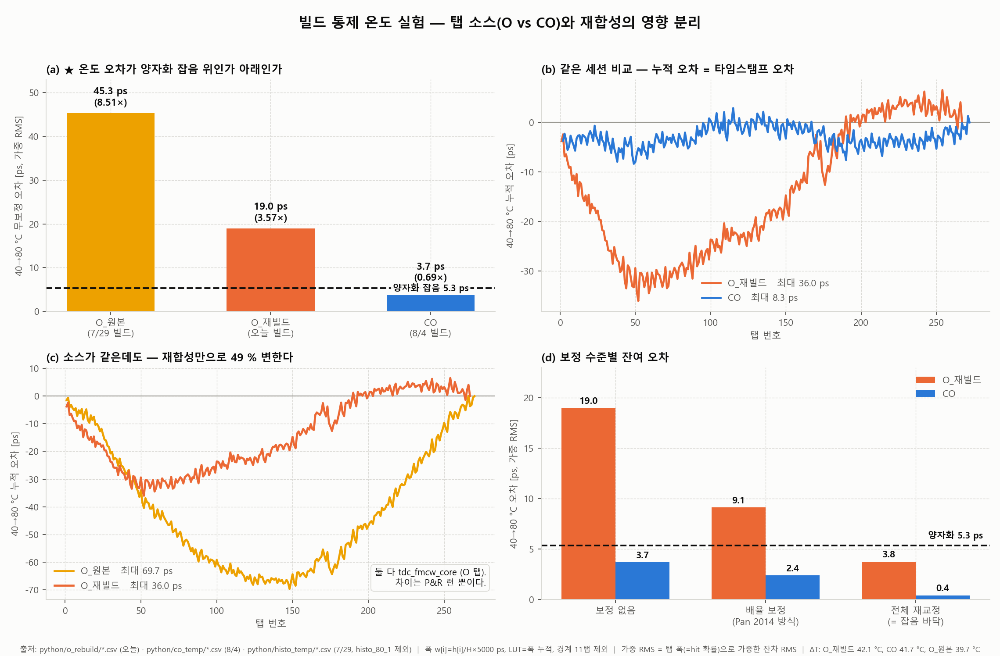

# 2026-08-10 작업 리포트 — 빌드 통제 온도 실험: 탭 소스 효과 확정, 재합성 영향 정량화

> **작성일** 2026-08-10
> **작성** Claude Opus 5 (Claude Code)

---

## 0. 용어

`2026-08-04_report.md` §0의 정의를 그대로 쓴다. 본 리포트에서 쓰는 것만 다시 적는다.

| 용어 | 정의 | 산출식 |
|---|---|---|
| **탭** | CARRY4 체인 위의 관측점. 80단 × 4 = 320개 | — |
| **O 탭 / CO 탭** | CARRY4의 어느 출력을 관측점으로 쓰는가. **O** = XOR 게이트 출력, **CO** = 캐리(MUXCY) 출력 | — |
| **폭** | 탭 하나가 담당하는 시간 구간 [ps] | `w[i] = h[i]/H × 5000`, `h` = 탭별 hit 수, `H` = 유효 구간 합 |
| **LUT** | 탭 번호 → 시간 변환표. 폭을 앞에서부터 누적한 것 | `LUT[i] = Σ_{k<i} w[k] + w[i]/2` |
| **LSB** | 평균 탭 폭 = 해상도 | `LSB = mean(w)` |
| **잔차** | 40 °C LUT로 답한 시간 − 80 °C의 진짜 시간 [ps]. 탭마다 하나씩 | — |
| **가중 RMS** | 잔차 270여 개를 평균내되 **각 탭의 오차에 그 탭의 폭을 곱해서** 평균. 폭 = hit이 떨어질 확률이기 때문 | `√(Σ pᵢ eᵢ²)`, `pᵢ = wᵢ/Σw` |
| **잡음 바닥** | **같은 온도** 반복 캡처끼리 위와 똑같은 절차를 적용한 값. 측정 자체의 흔들림 | — |
| **양자화 잡음** | 탭이 유한하다는 것만으로 생기는 원리적 하한. TDC가 아무리 완벽해도 이보다 잘할 수 없다 | `LSB/√12` |

> **가중이 무엇을 가중하는가:** 폭 76 ps인 탭에는 폭 1 ps인 탭보다 hit이 76배 자주 떨어진다. 270개 오차를 똑같이 1표씩 세면 거의 맞지 않는 탭이 과대 반영된다. **LUT나 COE를 건드리는 것이 아니라 오차를 요약하는 방식일 뿐이다.**

---

## 1. 오늘의 결론

1. **탭 소스 효과 확정.** 같은 세션에서 O와 CO를 비교하면 40→80 °C 무보정 드리프트가 **35.1 ps vs 9.0 ps (3.9배)**, 가중 RMS는 **19.0 ps vs 3.7 ps (5.1배)**다.
2. **★ 질적 판정이 갈린다.** 양자화 잡음 5.33 ps를 기준으로, **O는 그 위(3.57배), CO는 그 아래(0.69배)**다. 즉 **CO를 쓰면 단발 측정에서 온도 보정이 불필요해지고, O를 쓰면 불가능하다.**
3. **⚠️ 정정 — 8/4에 보고한 "8.4배"는 과대였다.** O 쪽이 7/29 빌드 데이터여서 재합성 성분이 섞여 있었다. 통제하면 **3.9~5.1배**다.
4. **🔴 이중 체인 구조가 선점당했다.** 오늘 ref에 올라온 **Jia et al., *IEEE TIM* 74, 2025 "Online Dual-Chain Calibration"** 이 두 TDL의 역할 교대 + RO code density + FSM + 무정지를 우리 구상과 점 하나까지 동일하게 구현했고, 20~80 °C 검증까지 마쳤다. **아키텍처 B 폐기.** (§5-3)
5. **⚠️ 재합성 영향이 매우 크다.** 소스가 같은데도 재빌드만으로 무보정 드리프트가 **68.6 → 35.1 ps (−49 %)** 변했다. INL에서는 15 %였는데 온도 특성에서는 49 %다. **빌드 하나로 온도 특성을 특징짓기에 부족하다.**

---

## 2. 왜 이 실험을 했나

8/4에 CO 빌드의 온도 특성이 O 빌드보다 8.4배 좋다고 보고했다(`2026-08-04_report.md` §3-5). 그런데 그 비교에는 **두 개의 교란**이 있었다.

| 교란 | 내용 |
|---|---|
| **빌드** | O 데이터는 **7/29 빌드**, CO는 8/4 빌드. 별개 P&R 런 |
| **측정 프로토콜** | O 시리즈는 반복 간 다이 온도가 0.74~1.23 °C 드리프트했고, CO 시리즈는 0.25~0.62 °C로 개선됐다 |

8/4 §2-7의 빌드 통제 실험에서 **재합성만으로 INL이 15 % 변한다**는 것이 이미 확인됐으므로, 온도 특성도 빌드에 의존할 수 있었다. **같은 세션의 O 빌드로 온도 시리즈를 다시 재는 것이 유일한 해결책**이었다.

---

## 3. 측정

**대상 빌드:** `tdc_fmcw_core`(O 탭). `tdc_test_top.v:224`가 이 모듈을 인스턴스한 상태에서 합성·구현·비트스트림.

**모드·ILA:** `2026-08-04_report.md` §2-4와 동일 — Mode 1(Ring Oscillator), 트리거 `readout_active==1`, position 0, ALWAYS, depth 1024.

**파일:** `python/o_rebuild/o_rebuild_{40,80}-{1,2,3}.csv` (2026-08-10 14:40~15:05 측정)

| 세트 | 설정 | 다이 온도 (회차별) | 세션 내 드리프트 | 총 hit | 유효 구간 |
|---|---|---|---|---|---|
| **O_재빌드** | 40 °C | 37.28 / 37.90 / 38.76 | **+1.48 °C** | 3.42e7 | 탭 1~278 |
| **O_재빌드** | 80 °C | 79.85 / 80.10 / 80.22 | +0.37 °C | 3.49e7 | 탭 1~285 |
| CO (8/4) | 40 °C | 39.50 / 39.62 / 39.99 | +0.49 °C | 3.34e7 | 탭 2~283 |
| CO (8/4) | 80 °C | 80.47 / 81.45 / 82.31 / 81.45 | +1.85 °C | 3.40e7 | 탭 2~289 |
| O_원본 (7/29) | 40 °C | 41.96 / 42.20 / 42.70 | +0.74 °C | 6.39e7 | 탭 1~281 |
| O_원본 (7/29) | 80 °C | 81.82 / 82.07 | +0.25 °C | 6.52e7 | 탭 1~285 |

> ⚠️ **O_재빌드의 40 °C 열평형이 나빴다** — 3회 캡처가 37.28 → 38.76 °C로 1.48 °C 움직였다. 이것이 O 쪽 잡음 바닥을 부풀렸을 수 있다(§4-3에서 정량화).

---

## 4. 결과

**계산:** 각 세트의 40 °C·80 °C 캡처를 모든 쌍으로 조합해 잔차를 내고 평균했다(O_재빌드 3×3=9쌍, CO 3×4=12쌍, O_원본 3×2=6쌍). 계산 구간은 각 세트의 공통 유효 구간에서 **경계 11탭을 제외**했다 — 경계 탭은 체인 길이와 클럭 주기의 관계 때문에 형상과 무관한 큰 값을 만든다(`2026-08-04_report.md` §3-4).

### 4-1. 종합 표

| 세트 | ΔT | LSB | **무보정 최대** | **무보정 가중RMS** | 배율보정 최대 | 배율보정 가중RMS | 잡음 바닥 (최대/RMS) |
|---|---|---|---|---|---|---|---|
| O_원본 (7/29) | 39.7 °C | 18.519 ps | 68.6 ps | 45.3 ps | 42.7 ps | 22.3 ps | 4.1 / 2.4 ps |
| **O_재빌드 (오늘)** | 42.1 °C | 18.727 ps | **35.1 ps** | **19.0 ps** | 30.2 ps | 9.1 ps | 6.1 / 3.8 ps |
| **CO (8/4)** | 41.7 °C | 18.450 ps | **9.0 ps** | **3.7 ps** | 5.9 ps | 2.4 ps | 1.0 / 0.4 ps |

### 4-2. ★ 핵심 — 양자화 잡음을 기준으로 갈린다 (그림 a)

$$\text{양자화 잡음} = \frac{\text{LSB}}{\sqrt{12}} = \frac{18.450}{\sqrt{12}} = 5.33\ \text{ps} \quad (\text{거리 } 0.80\ \text{mm})$$

이것은 **탭이 유한하다는 것만으로 생기는 원리적 하한**이다. TDC가 아무리 완벽해도 이보다 잘 잴 수 없다.

| 세트 | 무보정 가중RMS | 양자화 대비 | |
|---|---|---|---|
| O_원본 | 45.3 ps | **8.51 ×** | 온도가 오차를 지배 |
| **O_재빌드** | 19.0 ps | **3.57 ×** | 온도가 오차를 지배 |
| **CO** | **3.7 ps** | **0.69 ×** | **잡음에 묻힘** |

**배수가 3.9배냐 8.4배냐보다 이 임계선이 중요하다.**

> **O 탭에서는 온도 드리프트가 오차 예산을 지배하고, CO 탭에서는 TDC 자체 양자화 잡음 아래로 내려간다.**

정량 차이가 아니라 **질적 차이**다. 보정을 완전히 포기했을 때의 합성 오차로 보면:

| | 무보정 합성 오차 | 완전보정 | 차이 |
|---|---|---|---|
| O_재빌드 | √(19.0² + 5.33²) = **19.7 ps** | 5.33 ps | **+270 %** |
| CO | √(3.7² + 5.33²) = **6.5 ps** | 5.33 ps | +22 % |

> ⚠️ **단, 평균화하면 얘기가 달라진다.** 양자화 잡음은 평균 횟수 N에 대해 1/√N로 줄지만 **온도 오차는 계통 오차라 줄지 않는다.** FMCW처럼 수천 번 평균하는 응용에서는 CO의 3.7 ps도 그대로 바닥으로 남는다. 그때는 배율 보정으로 2.4 ps, 전체 재교정으로 0.4 ps까지 갈 수 있다(그림 d).

### 4-3. 유의성 — 잡음 바닥 대비

| 세트 | 신호(무보정 가중RMS) | 잡음 바닥(가중RMS) | 비 |
|---|---|---|---|
| O_재빌드 | 19.0 ps | 3.8 ps | **5.0 ×** |
| CO | 3.7 ps | 0.4 ps | **9.3 ×** |

둘 다 충분히 유의하다.

**O_재빌드의 잡음 바닥이 CO보다 9.5배 큰 것(3.8 vs 0.4 ps)은 부분적으로 열평형 문제다.** 40 °C 3회가 1.48 °C 퍼졌고, O의 감도가 19.0 ps / 42.1 °C = 0.45 ps/°C이므로 **약 0.67 ps**가 온도 스프레드로 설명된다. 나머지 3.1 ps는 실제 측정 변동이다. 어느 쪽이든 신호(19.0 ps)가 압도적이라 결론은 흔들리지 않는다.

### 4-4. ⚠️ 재합성 영향이 크다 (그림 c)

**같은 소스**(`tdc_fmcw_core`, O 탭)를 다시 빌드했을 뿐인데:

| | 무보정 최대 | 무보정 가중RMS | 유효 탭 | LSB |
|---|---|---|---|---|
| O_원본 (7/29) | 68.6 ps | 45.3 ps | 281 | 18.519 ps |
| O_재빌드 (오늘) | **35.1 ps** | **19.0 ps** | 278 | 18.727 ps |
| 변화 | **−49 %** | **−58 %** | | |

**8/4 §2-7에서 측정한 재합성 영향은 INL 기준 15 %였는데, 온도 특성에서는 49 %다.** 훨씬 크다.

**의미:** 온도 특성은 P&R에 강하게 의존한다. **빌드 하나의 값을 그 소자·그 구조의 특성으로 일반화할 수 없다.** 논문에 쓰려면 여러 빌드 통계가 필요하다.

> 다만 이 49 %에는 교란이 남아 있다. 7/29 빌드와 오늘 빌드 사이에 `top.v` 변경(thermometer 임시 포트 추가·제거)이 있었다. **순수 재합성 변동의 하한은 8/4 §2-7에서 CO로 측정한 1.3 %(INL 기준)**이고, 상한이 이 49 %다.

### 4-5. 누적 형태 (그림 b, c)

탭별 폭 변화 자체는 두 빌드가 비슷한데(8/4 §3-5), **누적되느냐 상쇄되느냐**에서 갈린다. LUT는 폭의 누적이므로 이것이 최종 오차를 결정한다.

- **O_재빌드**: 앞쪽 절반이 좁아지고 뒤쪽이 넓어지는 **장거리 쏠림**. 누적이 탭 50 부근에서 −36 ps까지 벌어진다.
- **CO**: 변화가 국소적으로 상쇄되어 **±8.3 ps에 머문다.**
- **O_원본**: 같은 쏠림이지만 −69.7 ps로 두 배 깊다.

---

## 5. 논문 관점

### 5-1. 살아남는 주장

> **어느 CARRY4 출력을 탭으로 쓰느냐가 딜레이라인의 온도 안정성을 결정한다. XOR 출력(O/S)에서는 40 °C 변화에 대한 오차가 양자화 잡음의 3.6배로 오차 예산을 지배하고, 캐리 출력(CO/C)에서는 0.69배로 잡음에 묻힌다. 후자에서는 한 온도에서 만든 LUT가 전 구간에서 유효하다.**

Carra *TNS* 2018은 C/S 16조합을 전수 비교했으나 **상온 정적 DNL만** 봤다. 온도 안정성 비교는 로컬 27편에 없다.

**실용적 파급:** 현재 학계는 런타임 온라인 교정 하드웨어를 만들고 있다 — Won *TBCAS* 2016은 20,000-deep FIFO + 2×128 카운터 + prefix adder, Pan *TNS* 2014는 전용 보조 채널. **이 결과는 탭 선택 한 줄로 그 필요의 상당 부분이 사라진다고 말한다.**

### 5-2. 약점

| 항목 | 상태 |
|---|---|
| **재합성 의존성 49 %** | 가장 큰 약점. 빌드 1개로는 특성화 불가 |
| 칩 1개, 보드 1개 | 소자 간 편차 미확인 |
| FPGA 계열 1종 (Zynq-7000, 28 nm) | 일반성 주장 불가 |
| 메커니즘 미규명 | "O 경로의 XOR 게이트 때문"은 **가설** |
| 온도 범위 40~80 °C | 좁음 |
| IEEE Xplore 미검색 | **선행연구 확인이 최우선** |

### 5-3. ★ 신규 논문 3편 검토 (커밋 `872c4b0`, 오늘 업로드)

#### 🔴 Jia et al., *IEEE TIM* **74, 2025** — "An FPGA-Based TDC With **Online Dual-Chain Calibration**"

**이중 체인 무정지 재교정 구조가 선점됐다. 우리 계획과 점 하나까지 같다.**

| 우리 구상 (아키텍처 B) | Jia 2025 원문 |
|---|---|
| 동일 딜레이 체인 2개 | "integrates **two TDLs** composed of CARRY4 units, one for time interval measurement and the other for **standby**" |
| 역할 교대 | "the system **swaps the roles of the two chains**: the standby chain becomes the new working chain" |
| RO code density로 대기 체인 교정 | "activating the **standby chain for a code density test**". RO는 cascaded LUT1 + LUT2 |
| 무정지 | "ensuring **continuous data collection** and system calibration" |
| 온도 감지로 교정 트리거 | RO 주파수를 초기값과 비교, 임계 초과 시 교정 상태 진입 |
| 상태 관리 | **FSM 4상태** — Initial → Work → Monitor → Calibration |
| 온도 범위 | **20~80 °C**, 교정 후 rms 20 ps 이하 |

**우리가 노리던 저널(IEEE TIM)에 2025년 게재.** 남는 차이는 하나뿐이고 얇다 — Jia는 RO 주파수 측정에 **외부 고정밀 클럭**(`STARTcal`/`STOPcal`)을 쓰고 우리는 XADC로 온칩 완결이 가능하다. 그러나 온칩 온도 센서 사용은 그 자체로 신규성이 없고(Pan 2014도 온칩), 트리거 소스만 바꾼 것으로는 논문이 되지 않는다.

**→ 이중 체인 방향 폐기.**

**그런데 이 논문이 방향 A(§5-1)를 오히려 강화한다.** Jia는 20~80 °C에서 성능을 유지하려고 이중 TDL + FSM + RO + 외부 클럭 + 주기적 code density(N = 1,024,000)를 전부 동원했다. 우리 결과는 **탭 소스 선택 하나로 그 문제의 상당 부분이 사라진다**고 말한다. **가장 좋은 대조군이 생겼다.**

> ⚠️ **지표 혼동 금지.** Jia의 "rms 20 ps"는 zero-interval 20만 회 측정의 **단발 정밀도**(지터·양자화 포함)이고, 우리 3.7 ps는 **LUT 형상 드리프트**다. 서로 다른 양이므로 직접 비교할 수 없다. 논문에서는 같은 지표로 다시 재거나, 비교 대신 "필요성 자체를 줄인다"는 논지로 써야 한다.

#### ⚪ Zhang et al., *J. Phys. Conf. Ser.* **1486, 2020** — "A high precision TDC design based on FPGA+ARM"

Artix-7 CARRY4 + code density, 정밀도 43.2 ps. 기본 구성이라 신규성 위협은 없다.

**다만 한 문장이 우리 발견과 직접 겹친다:**
> "the delay time is non-linear due to the **'look ahead' feature of the carry chain**"

8/4에 thermometer 실측으로 확인한 look-ahead 구조를 **2020년에 이미 언급**하고 있다. **"look-ahead 구조 확인"은 신규 발견이 아니라 기존 인식의 실측 확인으로 격하해야 한다.** 다만 도착 순서 `CO[1]→CO[3]→CO[2]→CO[0]`을 실측으로 특정하고 bin↔물리 소자 대응을 확정한 것은 여전히 새롭다.

#### ⚪ Zhang et al., *IOP Conf. Ser. MSE* **569, 2019** — "Design of a High Resolution TDC Based on Multi-channel"

64단 CARRY4 + code density. 위협 없음.

### 5-4. 이중 체인 구조 — 폐기

두 방향에서 동시에 무너졌다.

1. **자체 데이터** — CO 빌드에서는 단발 측정 시 재교정이 필요 없다(§4-2). 구조의 전제가 사라진다.
2. **선행연구** — Jia *TIM* 2025가 동일 구조를 선점(§5-3).

평균화 응용(FMCW 등)에서는 계통 오차 3.7 ps가 바닥으로 남아 재교정 여지가 있으나, **그 경우에도 구조 자체는 Jia와 같아진다.** 살릴 수 없다.

---

## 6. 파일 변경

| 파일 | 상태 |
|---|---|
| `Markdown/2026-08-10_report.md` | **신규** — 본 문서 |
| `Markdown/fig/2026-08-10_build_controlled_temperature.png` | **신규** — 그림 |
| `python/o_rebuild/o_rebuild_{40,80}-{1,2,3}.csv` | 측정 데이터. `.gitignore`의 `*csv`에 걸려 미커밋 |
| RTL | **변경 없음** (8/4에 임시 포트 원복 완료) |

---

## 7. 다음 할 일

### 🔴 우선

1. **IEEE Xplore 신규성 검색** — `carry output tap temperature FPGA TDC`, `C S pattern delay line thermal stability`, `carry chain tap selection` 등. **여기서 걸리면 나머지가 무의미하므로 가장 먼저.**
2. **재합성 통계 확보** — 49 %가 최대 약점이다. **O와 CO를 각각 3번씩 더 빌드해 온도 특성 분포를 낸다.** 각 빌드마다 40/80 °C 3회면 되고, 챔버 시간이 든다.
   판정: 두 분포가 겹치지 않으면 탭 소스 효과 확정. 겹치면 빌드마다 다르다는 결론.
3. **논문 방향 — 사실상 A 하나만 남았다.**

   | 안 | 내용 | 상태 |
   |---|---|---|
   | **A** | "탭 소스가 온도 안정성을 결정한다" | 🟢 **유일한 생존 후보.** ②의 결과에 달림 |
   | ~~B~~ | ~~평균화 응용 한정 + 이중 체인~~ | ❌ Jia *TIM* 2025 선점 (§5-3) |
   | ~~C~~ | ~~A + B 결합~~ | ❌ B가 죽어 성립 불가 |

   A마저 ①(Xplore 검색)이나 ②(재합성 통계)에서 무너지면 **논문 주제를 다시 세워야 한다.**

### 🟡 여건 되면

4. **메커니즘 규명** — O 경로의 XOR 게이트가 원인이라는 가설 검증. 온도별로 `report_timing` arc를 다시 뽑는 방법이 있다.
5. **NCCC 다운샘플링** (Carra 2018) — popcount에서 CARRY4당 탭 하나를 빼면 된다. 신규성은 없으나 INL이 더 좋아질 수 있다.
6. **열평형 프로토콜 표준화** — 이번에도 O_재빌드 40 °C가 1.48 °C, CO 80 °C가 1.85 °C 퍼졌다. **XADC 다이 온도가 1분간 0.1 °C 미만으로 안정된 뒤 누적 시작**을 규칙으로 굳힐 것.

### 📝 문서

7. `Markdown/2026-08-04_report.md` §3-5의 "69.7 vs 8.3 ps = 8.4배"에 정정 이력 추가 — 통제값은 35.1 vs 9.0 = 3.9배
8. `Markdown/2026-07-29_report.md` §2-0 / §2-2 정정 (지표 A 기반 수치 폐기) — 미수행 이월
9. `Markdown/Paper_Roadmap.md` — §2.4/§2.5 이중 체인의 전제 붕괴 반영, 신규 방향 A 추가

---

## 8. 미해결

| 항목 | 상태 |
|---|---|
| **온도 특성의 재합성 의존성 49 %** | **최대 약점.** 빌드 통계 필요(§7-2) |
| CO 개선 / 온도 안정성의 메커니즘 | **미해결.** XOR 게이트 가설은 미검증 |
| 소자 간·계열 간 일반성 | 미확인 (칩 1개, Zynq-7000만) |
| 논문 방향 | **A 하나만 생존.** B·C는 Jia *TIM* 2025 선점으로 폐기(§5-3). A도 §7-1·§7-2에 달림 |
| **방향 A의 선행연구 확인** | **미수행.** ref 폴더에 없던 논문 1편이 올라오자 주력 방향이 죽었다. Xplore 검색 없이는 어떤 방향도 확정 불가 |
| CARRY4 내부 구간별 온도계수의 물리적 원인 | 미해결 — `CO[3]→CO[2]`가 −4202 ppm/°C로 가장 민감하나 look-ahead 경로 두 개의 차이라 단일 소자에 대응되지 않음 (8/4 §3-6) |
| CDC 결손 (`capture_arm`) | 수정 보류. DPS(Mode 0)를 쓰려면 선행 필요 |
| T15 신규성 웹 재조사 | 미수행 (§7-1) |
