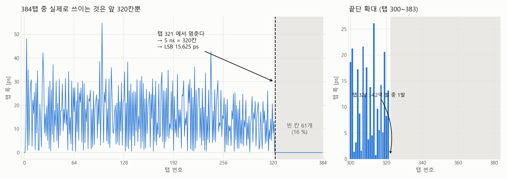
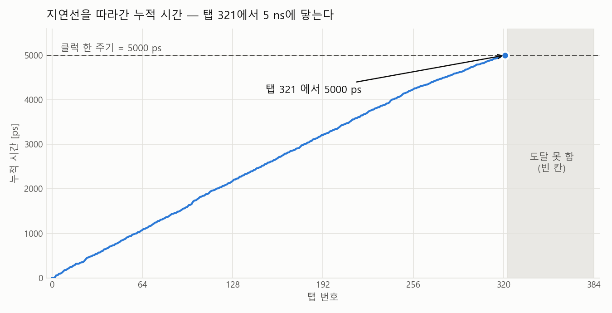
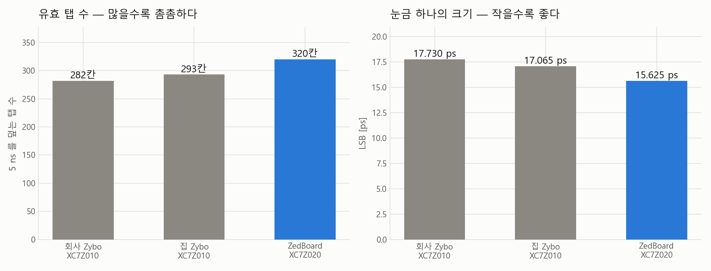
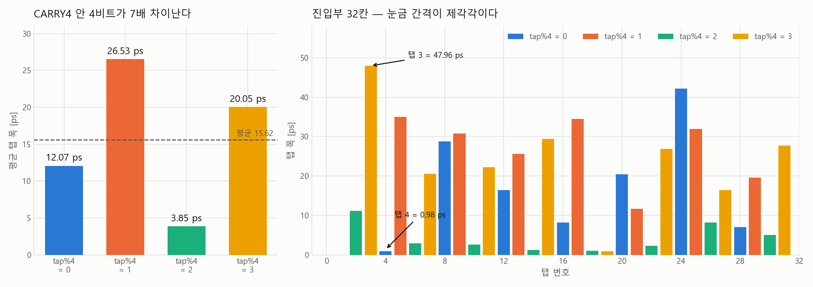

# 2026-09-04 작업 보고 — ZedBoard 캐리체인 384탭 확장과 유효탭 상한 실측

> **작성일** 2026-09-04
> **작성** Claude Opus 5 (Claude Code)
> **커밋** `b69f5f4` (RTL·스크립트), `a52966a` (측정 데이터)
> **주의** AI가 생성한 문서입니다. 수치는 사용 전 원본 CSV·리포트와 대조하십시오.

---

## 0. 한 줄 요약

**ZedBoard 가 클럭 한 주기(5 ns)를 덮는 데 필요한 탭은 320개이고, 눈금 하나(LSB)는 15.625 ps 다.**
집에서 보드를 직접 물려 4.2억 발을 쌓아 확인했다.

---

## 1. 오늘 답해야 했던 질문

어제(9/3) 회사 측정에서 **320탭 히스토그램이 전부 채워졌다.** 끝단에 빈 칸이 하나도 없었다.

빈 칸이 없으면 두 가지가 곤란하다.

1. **유효탭 상한을 읽을 방법이 없다.** 히스토그램이 "여기서 멈춘다"고 알려주지 않는다.
2. **최악의 경우 사각지대가 생긴다.** 320탭을 다 지나고도 시간이 남으면 `sum_fine = 320` 이 되는데,
   `tdc_calib_rom` 이 320칸이라 **주소 범위 밖**을 읽는다.

그래서 **체인을 일부러 길게 만들어** 히트가 어디서 멈추는지 보이게 하는 것이 오늘의 작업이었다.
384탭은 최종 설계값이 아니라 **자(尺)** 다 — 필요한 것보다 길게 만들어 눈금을 읽는 도구.

---

## 2. 측정 결과

### 조건

| 항목 | 값 |
|---|---|
| 보드 | ZedBoard XC7Z020-CLG484-1, **DNA `0x3D996854`** (9/3 회사 측정과 같은 보드) |
| 체인 | **96단 = 384탭** |
| 모드 | `OPERATION_MODE = 1` (링오실레이터 히트, `clk_200_fixed` 샘플링) |
| **총 히트 H** | **420,252,151 발** |
| **다이 온도** | **40.80 ~ 41.31 °C** |
| 링오실레이터 | 111.0 MHz → 히트율 0.867 MHz |
| 원본 | `Data/20260904_zed_mode1.zip` |

> **탭 폭 계산** : `w[i] = h[i] / H × 5000 ps`
> 근거는 코드밀도 원리다 — 비동기 히트가 균일하게 도착하면 어떤 탭에 떨어지는 빈도는
> 그 탭의 폭에 비례한다. 링오실레이터는 200 MHz 클럭과 무관하게 발진하므로 성립한다.
> 아래 통계는 모두 **유효 구간 탭 2~321** 에서 계산했다.

### ★ 답 — 히트가 탭 321에서 멈춘다



| 항목 | 값 |
|---|---|
| 히트가 조금이라도 있는 탭 | 2 ~ 322 |
| **실질 유효 탭** | **2 ~ 321 = 320칸** |
| 탭 322 | **4.2억 발 중 1발** — 경계라 세지 않는다 |
| **LSB** | **5000 / 320 = 15.625 ps** |
| **빈 칸 (카운트 0)** | **탭 323 ~ 383 = 61칸 (16 %)** |

**빈 칸이 확실하게 생겼다.** 384탭으로 늘린 목적이 달성됐고, 앞으로는 유효탭 상한을
히스토그램에서 그냥 읽으면 된다.

### 왜 320탭 빌드에서 전부 찼는지 설명된다



지연선을 따라 탭 폭을 누적하면 **탭 321에서 정확히 5000 ps 에 닿는다.**
320탭 빌드는 인덱스가 0~319 였으니 **전 구간이 도달 범위 안**이었다. 딱 2 탭 차이였다.

어제 추정한 상한(`LSB ≤ 15.625 ps`, "320칸이 5 ns 안에 다 들어갔다"에서 나온 값)과
오늘 실측이 **소수점까지 일치한다.**

### 세 보드 비교 — ZedBoard 가 가장 좋다



| 보드 | 칩 | 유효탭 | LSB |
|---|---|---|---|
| 회사 Zybo `0x2E496854` | XC7Z010 | 282 | 17.730 ps |
| 집 Zybo `0x641A285C` | XC7Z010 | 293 | 17.065 ps |
| **ZedBoard `0x3D996854`** | XC7Z020 | **320** | **15.625 ps** |

같은 28 nm 공정인데 눈금이 12 % 촘촘하다. 공정 편차이거나 XC7Z020 과 XC7Z010 의 차이인데,
**어느 쪽인지는 이 데이터로 구분할 수 없다** (표본이 칩 3개뿐이고 디바이스가 섞여 있다).

### 눈금 간격이 제각각이다 — 교정이 필요한 이유



| `tap % 4` | 평균 폭 |
|---|---|
| 0 | 12.07 ps |
| 1 | **26.53 ps** |
| 2 | **3.85 ps** |
| 3 | 20.05 ps |

**CARRY4 한 개 안의 4비트가 최대 7배 차이난다.** 진입부는 더 심해서 탭 3 이 47.96 ps,
바로 옆 탭 4 가 0.98 ps 다. 7-series CARRY4 가 4단 리플이 아니라 캐리 look-ahead 구조이기
때문이다 (2026-08-05 thermometer 실측으로 확인된 사실).

| 탭 폭 통계 (탭 2~321) | 값 |
|---|---|
| 최소 / 중앙 / 평균 / 최대 | 0.22 / 15.08 / 15.62 / 54.74 ps |
| 폭 < 0.5 ps | 5칸 |
| 폭 < 1.0 ps | 18칸 |
| 폭 < 2.0 ps | 38칸 |
| 카운트 0 인 탭 | **0칸** |

**양자화 한계**

```
sigma = sqrt( sum(w^3) / (12 * sum(w)) ) = 7.35 ps
```

교정을 아무리 잘해도 **단발 측정은 이보다 좋아질 수 없다.** 폭이 제각각인 자에서
"어느 칸에 걸렸다"만 알 때 남는 불확실성이다. (Won & Lee, IEEE TIM 2016 eq.(4) 와 같은 정의)

---

## 3. 무엇을 만들었나

### 3-1. 체인을 단수에서 유도하도록 파라미터화

`tdc_fmcw_core_co.v` 의 popcount 트리가 320탭에 하드코딩돼 있었다 —
`stg1_half*[0:19]` 는 "16비트 묶음 20개", `stg3_group0~3` 은 "묶음 5개씩 4덩어리" 로
`320 = 4 x 5 x 16` 전용이었다.

```verilog
localparam integer NGRP = CARRY4_STAGES / 4;   // 16비트 묶음 개수 (96단 -> 24)
localparam integer GPQ  = NGRP / 4;            // stg3 한 덩어리가 맡는 묶음 (96단 -> 6)
```

**선언 폭은 하나도 안 바꿨다** — `sum_fine`/`ts_fine_idx` 가 `[8:0]`(≤511),
히스토그램이 512칸, `stg3_group` 이 `[7:0]`. 기본값은 80단(320탭) 그대로라 **Zybo 빌드는 영향 없다.**

### 3-2. 쓸 수 있는 단수는 셋뿐이다

단수가 **16의 배수**여야 `GPQ` 가 정수가 된다. 그리고 448이 상한이다 (512면 `sum_fine` 이 10비트).

| 탭 수 | 단수 | 가능? |
|---|---|---|
| 320 | 80 | 현행 |
| **384** | **96** | **채택** |
| 448 | 112 | 가능하나 타이밍이 빠듯 |
| 400 | 100 | **불가** — `GPQ = 6.25` |

### 3-3. XDC 생성기 (`python/gen_chain_xdc.py`, 신규)

체인 LOC/BEL 제약은 단마다 25줄씩 반복된다 — 96단이면 2400줄이다. 손으로 고칠 분량이 아니고,
한 줄만 틀려도 그 단이 배치기 마음대로 놓여 지연선 특성이 통째로 달라진다.

**검증**: 80단으로 돌려 기존 파일과 **바이트 단위로 동일**함을 확인한 뒤 96단을 적용했다.

### 3-4. 프로젝트 생성 스크립트 (`build_zedboard.tcl`, 신규)

ZedBoard 프로젝트가 회사 PC 에만 있어서 집에서 테스트하려면 IP 4개 설정을 손으로 다시
넣어야 했다. 스크립트 한 줄로 만들어지게 했다.

```
vivado -mode batch -source build_zedboard.tcl -tclargs 1 zed_mode1 1
                                                       │  │          └ 1 = 합성~비트스트림까지
                                                       │  └ 프로젝트 이름
                                                       └ OPERATION_MODE
```

**VCO 를 스크립트가 직접 검산한다.** `M/D` 를 읽어 `100 x M / D` 가 1000 MHz 가 아니면
그 자리에서 멈춘다 — Vivado 가 다른 M/D 조합을 자동 제안해서 위상 스텝 17.857 ps 가
깨지는 것이 이 프로젝트의 가장 흔한 함정이라서다.

---

## 4. 타이밍 — 384로 정한 근거

처음에 448탭(112단)으로 갔다가 타이밍이 안 닫혀서 384로 내렸다. 경과는 이렇다.

| 시도 | 구현 전략 | WNS | 임계경로 |
|---|---|---|---|
| 448탭, pblock X42~X47 | 기본 | **−0.226 ns** ❌ | `stg1_half*` → `stg3_group` |
| 448탭, pblock X42~**X59** | 기본 | **−0.070 ns** ❌ | 〃 |
| 448탭 | 고강도 + phys_opt | +0.005 ns | — |
| **384탭** | 기본 | +0.010 ns | `stg3_group` → `danger_zone_stg4` |
| 384탭 | 고강도 + phys_opt | +0.098 ns | — |
| **384탭 + `danger_zone` 이동** | **기본** | **+0.131 ns** ✅ | **ILA IP 내부** |

### 두 번의 수정

**(1) pblock 확대** (+156 ps) — 파이프라인을 `SLICE_X42~X47` 6열에 가뒀는데,
X42/X43 을 체인이 통째로 차지해서 트리가 쓸 수 있는 건 **4열뿐**이었다. X59 까지 넓혔다.
위반 경로의 지연 중 **64~67 %가 배선**이었던 것이 근거다 (로직은 1.6~1.8 ns 뿐).

**(2) `danger_zone` 비교를 Stage 4 → Stage 5 로 이동** (+121 ps)

`danger_zone` 은 "히트가 클럭 에지 근처에 왔는가" 를 판정해서, 그렇다면 0° 카운터 대신
반 주기 어긋난 180° 섀도우 카운터를 쓰게 하는 장치다 (메타스테이빌리티 회피).
문제는 Stage 4 가 **한 사이클에 4항 덧셈과 비교 2개를 전부** 하고 있었던 것이다.

```verilog
// 기존 (Stage 4)
sum_fine = stg3_group[0]+[1]+[2]+[3];
danger_zone_stg4 <= (sum_fine < 40 || sum_fine > 220);   // ← 덧셈 직후 비교까지

// 변경 (Stage 5, 레지스터된 값으로)
if (fine_idx_stg4 < DANGER_LO || fine_idx_stg4 > DANGER_HI) ...
```

`fine_idx_stg4 == sum_fine` 이므로 **같은 값을, 같은 사이클에, 같은 곳에서 쓴다.**
동작도 레이턴시도 안 바뀌고 임계경로만 둘로 쪼개진다.

**결과적으로 임계경로가 ILA IP 내부로 옮겨갔다 — TDC 데이터패스는 더 이상 병목이 아니다.**

### 384탭이 적정한가 — 온도 여유

| 온도 | 필요한 탭 | 384탭 여유 |
|---|---|---|
| 41 °C (실측) | 320 | 64칸 |
| 60 °C (외삽) | 322 | 62칸 |
| 85 °C (외삽) | 324 | 60칸 |

> 외삽은 회사 Zybo 실측 계수 **−1.2 %/40 °C** 를 적용한 **가정**이다
> (`Markdown/2026-08-03_report.md:307` — 41 °C 탭 277 → 80 °C 탭 281).
> ZedBoard 자체 온도 계수는 **아직 안 쟀다.**

### 최종 빌드

| 항목 | 값 |
|---|---|
| CARRY4 / `taps_sampled_d1_reg` | **96 / 384** (기대값과 일치) |
| WNS / WHS | **+0.131 / +0.053 ns**, 위반 엔드포인트 0 |
| 자원 | LUT 6.2 %, Slice 12.2 %, BRAM 30 % |
| DRC | 0 Errors |

---

## 5. 정정한 것

**"폭이 0인 탭 27개"는 틀렸다.**
9/3 Mode 2 데이터에서 탭 40~279 중 27개가 히트 0발이라 미싱 코드라고 봤는데,
그건 **표본이 2,048발뿐이라 생긴 착시**였다. 4.2억 발로 보면 유효 구간 안에
카운트 0 인 탭은 **하나도 없다.** 다만 폭이 매우 좁은 탭(< 1 ps)이 18개 있는 것은 사실이다.

---

## 6. 오늘 만든/고친 파일

| 파일 | 변경 |
|---|---|
| `RTL/tdc_fmcw_core_co.v` | 트리 파라미터화, `danger_zone` → Stage 5, `DANGER_LO/HI` 명명 |
| `RTL/tdc_test_top.v` | `CARRY4_STAGES` 파라미터(기본 80), 스캔 범위 `NUM_TAPS-1` |
| `RTL/tdc_zedboard_top.v` | `CARRY4_STAGES(96)` 전달 |
| `RTL/tdc_zedboard.xdc` | 96단 재생성(2400줄), pblock X47 → X59 |
| `python/gen_chain_xdc.py` | **신규** — 체인 LOC/BEL 생성기 |
| `build_zedboard.tcl` | **신규** — 프로젝트 생성 + IP 4개 + 합성/검증 |
| `python/plot_20260904_zed.py` | **신규** — 이 보고서의 차트 |
| `python/*.py` 4개 | `NUM_TOTAL_TAPS` 320 → 384 |
| `.gitignore` | `vivado/`, `*.jou`, `*.str`, `.Xil/` 추가 |
| `Data/20260904_zed_mode1.zip` | **신규** — 측정 원본 7개 파일 |

---

## 7. 다음 — 전체 구조 최적화 (PS + AXI-Lite)

유효탭을 확인했으니 교정으로 바로 가지 않고 **구조부터 정리하기로 했다.**

### 왜 지금인가

지금은 교정표를 바꾸려면 `COE → IP 재생성 → 합성 → 배치배선 → 새 비트스트림` 이고,
그 순간 place & route 가 달라져 **이전 교정 데이터가 무효화된다.**
교정 ROM 을 AXI 로 쓸 수 있는 BRAM 으로 바꾸면 **하드웨어를 고정하고 표만 갈아끼운다** —
BEFORE/AFTER 비교의 최대 오차 요인이 사라진다. 교정은 그 구조가 선 뒤에 하는 것이 맞다.

### 모드 재정의 (사용자 지정)

| 새 번호 | 용도 |
|---|---|
| **mode 0** | 링오실레이터 기반 코드밀도 측정 |
| **mode 1** | DPS 기반 지터 평가 — 특정 위상에 세워두고 반복 측정 |
| **mode 2** | 실측 — 고속비교기 신호의 시간 간격 (비트 주파수) |

### 진행 순서

| 단계 | 내용 | 검증 |
|---|---|---|
| **1** | AXI4-Lite 슬레이브 뼈대 (ID/BUILD/CTRL/STATUS/DNA) | PS 가 `0x54444301` 을 읽으면 성공 |
| 2 | 히스토그램 AXI 리드백, 리드아웃 스캐너 삭제 | 읽은 히스토그램 = 기존 ILA 결과 |
| 3 | 캡처 버퍼 + 시퀀서 FSM (4상태) | SW 로 만든 히스토그램 = HW 히스토그램 |
| 4 | 교정표를 쓰기 가능 BRAM 으로 | 램프 write→read 일치 |
| 5 | 위상 시프터를 목표스텝 방식으로, 스윕을 PS 가 | 소프트웨어 스윕이 기존 전달함수 재현 |
| 6 | 실시간 mode 2 (DMA) | 나중 |

1~3 단계 동안 **ILA 는 폴백 겸 대조군으로 남긴다.**

### 이 구조로 없어지는 것

오늘 겪은 문제들이 대부분 여기서 정리된다.

- **`CAP_PER_STEP=16` 게이팅** → 9/3 Mode 2 데이터의 9.75 ms 구멍 127개의 원인. `dps_en` 으로 끈다.
- **리드아웃이 위상 스윕 완료에 묶인 것** → 오늘 히스토그램을 뜨려고 **버튼을 눌러야 했다.**
- **`danger_zone` 임계값 (40, 220)** → 옛 O 탭 분포로 튜닝됐고 재튜닝된 적이 없다. 레지스터로 뺀다.
- **어떤 COE 가 올라가 있는지 데이터가 모르는 것** → 9/3 에 `dummy_rom.coe` 를 역산해야 했다.

---

## 8. 미해결 / 확인 필요

| 항목 | 내용 |
|---|---|
| ZedBoard 온도 계수 | −1.2 %/40 °C 는 **회사 Zybo 값을 빌린 가정**이다. 챔버로 재야 한다 |
| LSB 차이의 원인 | ZedBoard 가 Zybo 보다 12 % 촘촘한 것이 공정 편차인지 디바이스 차이인지 구분 불가 |
| LVDS 비교기 | 9/3 스코프에서 LVDS 에지가 CH1 영교차보다 1.9 µs 앞섰다. 비교기 입력 핀에서 빠른 시간축으로 재야 한다 |
| J18 점퍼 | 실물 확인 필요 (9/3 데이터로는 판단 불가 — 100 Ω 없이 1 MΩ 으로 측정했으므로) |
| 비교기 부품번호 | 저장소에는 TLV3605 가 아니라 `Parts/tlv3801.pdf` 만 있다 |
