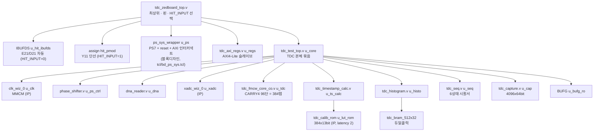
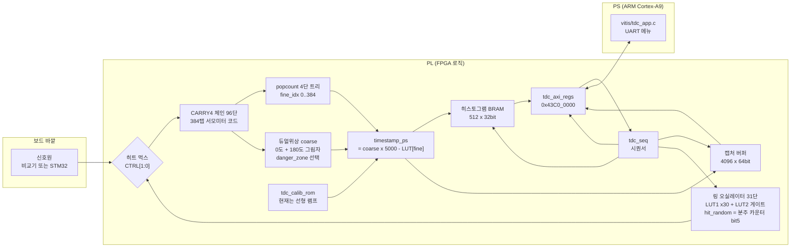
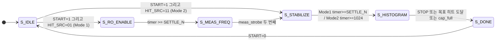
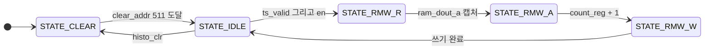
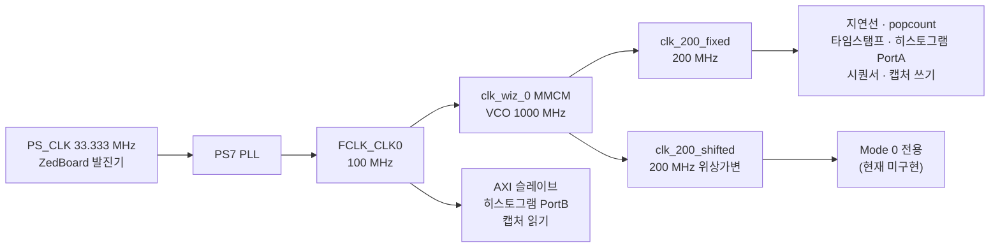

# TDC RTL 구조도 (2026-09-06 기준)

> **작성일** 2026-09-06
> **작성** Claude Opus 5 (Claude Code)
> **출처** 이 문서의 모든 블록·신호·상태는 `RTL/*.v` 를 직접 읽어 그린 것이다.
> 각 그림 아래에 근거 파일과 줄 번호를 적었다. 추측으로 그린 블록은 없다.
> **범위** `build_zedboard.tcl:84-95` 가 프로젝트에 넣는 **Verilog 10개**만 그린다.
> `RTL/` 에 있는 나머지 4개(`tdc_fmcw_core.v`, `_co_thermo`, `_mix`, `_mix_thermo`)는
> 옛 실험용이라 **빌드에 들어가지 않는다.**

---

## 0. 이전 대비 무엇이 간소화됐나

| 없어진 것 | 언제·왜 |
|---|---|
| **ILA (`ila_0`)** + 리드아웃 스캐너 | 2026-09-05. 히스토그램을 AXI 가 직접 읽게 되어 불필요. BRAM 42개 → 1개, WNS +0.089 → +0.209 ns |
| `readout_active` / `sweep_addr` / `probe_read_addr_d1` | 위와 함께 제거. 읽기 지연 1클럭 보상은 `tdc_axi_regs` 의 `hpend` 로 옮겨감 |
| **BTNU 버튼 트리거** | 스캐너 시작 조건이 `ps_busy` 하강 에지였고, Mode 1 에서는 사람이 버튼을 눌러야 했다. 그 절차가 문서에 없어 2026-09-05 에 빈 CSV 를 받았다 |
| 빌드 시 모드 고정 | Mode 1 ↔ 2 를 런타임 먹스로 전환 (`CTRL[1:0]`) |

| 새로 생긴 것 | 역할 |
|---|---|
| `tdc_axi_regs.v` | AXI4-Lite 슬레이브. PS 가 모든 제어·판독을 여기로 한다 |
| `tdc_seq.v` | 6상태 시퀀서. 측정 한 회를 자동으로 진행 |
| `tdc_capture.v` | 4096×64bit 캡처 버퍼 (Mode 2 용) |

**요약**: 데이터가 나가는 길이 *ILA + 사람이 누르는 버튼* 에서 *AXI + PS 프로그램* 으로 바뀌면서,
관측용 배선이 통째로 사라지고 그 자리에 레지스터 파일과 시퀀서가 들어왔다.

---

## 1. 모듈 계층 (누가 누구를 인스턴스화하나)



**근거**: `tdc_zedboard_top.v:119, 147, 243, 307` / `tdc_test_top.v:116, 123, 151, 206, 300, 371, 387, 461, 480, 521` / `tdc_timestamp_calc.v:22` / `tdc_histogram.v:205`

> `clk_wiz_0`, `xadc_wiz_0`, `tdc_calib_rom` 은 **저장소에 소스가 없는 Xilinx IP** 다.
> `build_zedboard.tcl` 이 만든다.

---

## 2. 데이터 흐름 — 히트 한 발이 PS 까지 가는 길



**근거**: `tdc_test_top.v:344-351` (먹스), `:369-380` (코어), `:387-397` (타임스탬프),
`:458-472` (히스토그램), `:480-521` (시퀀서·캡처) / `tdc_fmcw_core_co.v` / `tdc_timestamp_calc.v:22-97`

### 이 그림에서 꼭 알아둘 것

- **`tdc_calib_rom` 에는 지금 선형 램프가 들어 있습니다.** 코드밀도로 만든 교정표가
  FPGA 에 올라간 적은 **한 번도 없습니다** (`python/tdc_calib_mode0_rom.coe`, 0 → 4987, 약 13.02 ps 간격).
- 히스토그램과 캡처 버퍼는 **동시에 하나만** 켜집니다 — `tdc_seq.v:239-240` 에서
  `histo_en` 은 Mode 1, `cap_en` 은 Mode 2 로 갈립니다.

---

## 3. `tdc_seq.v` — 6상태 시퀀서 (이번 개편의 핵심)



**근거**: `tdc_seq.v:85-90` (상태 정의), `:162-189` (IDLE 분기), `:198-201`, `:209-222`,
`:227-246`, `:249-277`, `:282-287`

### 상태별로 무엇을 하나

| 상태 | 값 | 하는 일 | 나가는 조건 |
|---|---|---|---|
| `S_IDLE` | 0 | 모든 enable 을 내리고 대기 | `START=1` + `HIT_SRC` |
| `S_RO_ENABLE` | 1 | RO 를 켜고 초기 트랜지언트를 기다림 | `timer >= settle_n` |
| `S_MEAS_FREQ` | 2 | **온전한 게이트 하나**를 기다려 RO 주파수 측정 | 두 번째 `meas_strobe` |
| `S_STABILIZE` | 3 | 히스토그램/캡처 버퍼 비우기 + 안정화 | 아래 참조 |
| `S_HISTOGRAM` | 4 | **실제 누적 구간** | `STOP` / 목표 도달 / `cap_full` |
| `S_DONE` | 5 | `DONE=1` 유지 | `START=0` |

### Mode 1 과 Mode 2 는 같은 상태를 다르게 씁니다

| | Mode 1 (RO) | Mode 2 (외부) |
|---|---|---|
| 경로 | IDLE → RO_ENABLE → MEAS_FREQ → STABILIZE → HISTOGRAM → DONE | IDLE → **STABILIZE** → HISTOGRAM → DONE |
| RO | 켠다 | 안 켠다 |
| STABILIZE 대기 | `settle_n` (기본 100 µs) | **1024 클럭(5.1 µs)만** |
| 누적 대상 | 히스토그램 (`histo_en`) | 캡처 버퍼 (`cap_en`) |
| 끝나는 조건 | 목표 히트 수 도달 | **캡처 버퍼가 참** (`cap_full`) |

> **이름 주의** — `S_HISTOGRAM` 은 Mode 2 의 캡처 구간에도 쓰입니다.
> `tdc_seq.v:95-101` 에 그 이유가 적혀 있습니다: 상태를 늘리면 PS 쪽 해석 코드가
> 모드마다 갈라지기 때문입니다. **"누적 구간"으로 읽으십시오.**
> RTL 주석도 "이름을 `S_ACQ` 로 바꾸는 것이 옳다"고 인정하고 있습니다.

### 왜 종료 판정이 감소 카운터인가

처음에는 이렇게 썼다가 **타이밍이 깨졌습니다**:

```verilog
if (ctrl_stop || ((hit_cnt + (hit_accepted?1:0)) >= target_hits))
```

32비트 덧셈(CARRY4 8개) → 32비트 비교 → 그 결과가 여러 레지스터의 CE 를 구동.
**실측: 논리 12단, 데이터 지연 5.900 ns > 예산 5 ns, slack −1.161 ns, 위반 60곳**
(`vivado/zed_fsm/timing_summary.rpt`, 지금은 `Data/20260905_zed_fsm.zip` 안에 있음).

고친 방법 — 남은 수를 세는 감소 카운터를 두고, "이번 히트로 0 이 된다"를 **미리 1비트
레지스터에 담아** 둡니다. 종료 조건은 그 1비트만 봅니다 (`tdc_seq.v:110-124, 256-267`).

---

## 4. `tdc_histogram.v` 내부 — RMW 가 왜 3상태인가



**근거**: `tdc_histogram.v:50-54` (상태 정의), `:78-130` (전이)

**R 과 A 를 한 사이클로 합치면 안 됩니다.** 두 가지가 동시에 깨집니다:

1. **타이밍** — BRAM `Tcko` + 32비트 가산기 > 5 ns 예산
2. **데이터 해저드** — 직전 히트의 낡은 `count_reg` 가 현재 주소에 더해짐.
   이것이 예전에 히스토그램이 평평해 보이던 근본 원인이었습니다

### 히트 수용/폐기 신호

```verilog
assign hit_accepted = (state == STATE_IDLE) && ts_valid && en;
assign hit_dropped  = (state != STATE_IDLE) && (state != STATE_CLEAR) && ts_valid && en;
```

RMW 3사이클 동안 들어온 히트는 버려집니다. 이것이 **데드타임**입니다.

- **데드타임** = 3사이클 × 5 ns = **15 ns** (파생값). `tdc_test_top.v:226` 주석의
  "TDC 데드타임(~15ns)" 과 일치합니다.
- **Mode 1 실측 드롭률은 0.00%** 였습니다 (측정값, `HIT_CNT` 대 `DROP_CNT`).
- **왜 0 인가**: `hit_random = ro_divider_cnt[5]` 로 ÷64 분주 출력이라
  (`tdc_test_top.v:211`), 히트 간격이 `64 / f_RO` 로 **거의 일정**합니다.
  푸아송 도착이 아니므로 짧은 간격이 몰리는 일이 없습니다.

> **간격의 절대값은 확정하지 않겠습니다.** 측정된 `f_RO ≈ 55.5 MHz` 를 넣으면
> `64 / 55.5 MHz = 1153 ns` 가 나오는데, 이전 세션에서 **951 ns** 로 적은 적이 있고
> 두 값이 서로 맞지 않습니다 (951 ns 는 `f_RO = 67.3 MHz` 에 해당). 어느 쪽이
> 맞는지는 `RO_CNT` 를 다시 읽어 `f_RO = RO_CNT × 4 / 10` [kHz] 로 계산하면
> 바로 확인됩니다. **드롭률 0.00% 라는 결론 자체는 실측이라 영향받지 않습니다.**

---

## 5. 클럭 도메인



**근거**: `tcl/bd_ps_sys.tcl` (PS_CLK 33.333333, FCLK 100 MHz) / `tdc_test_top.v:123-149` (MMCM),
`:340-350` (모드별 `tdc_clk` 선택) / `tdc_zedboard_top.v:264-268` (`i_axi_clk` = `fclk`)

### CDC 를 어떻게 넘나

| 경로 | 방법 |
|---|---|
| 히스토그램 읽기 | **듀얼클럭 BRAM.** Port A = `tdc_clk`, Port B = `s_axi_aclk`. CDC 로직 자체가 없다 |
| 다중비트 제어값 (TARGET_HITS, SETTLE_N, DANGER …) | **1비트 토글 핸드셰이크.** 토글이 바뀔 때 수신 쪽이 레지스터 전체를 한 번에 래치 |
| `CTRL` 레지스터 | `HIT_SRC`(2비트)와 `START` 를 **한 워드에** 담는다. 비트마다 따로 동기화하면 `START` 가 `HIT_SRC` 보다 한 클럭 먼저 도착해 엉뚱한 모드로 출발할 수 있다 (`tdc_axi_regs.v:40-42`) |

---

## 6. 아직 안 된 것 (그림에 없는 것)

| 항목 | 상태 |
|---|---|
| **Mode 0 (DPS 위상 스윕)** | `clk_200_shifted` 경로는 있지만 `OPERATION_MODE=0` 전용 빌드가 필요. 미측정 |
| **교정표 BRAM 화** | 현재 ROM 은 읽기 전용 + 선형 램프. PS 가 쓰는 BRAM 으로 바꾸는 것이 다음 과제 |
| `CTRL[5]` `TDC_RST` | 레지스터 맵에는 있으나 **하드웨어에 연결 안 됨** |
| **TDC 자체 정밀도** | 한 번도 측정된 적 없음 |

---

## 7. 이 문서를 고칠 때

RTL 을 바꾸면 이 문서도 같이 고쳐야 합니다. 특히:

- `tdc_seq.v` 의 상태를 늘리면 → §3 상태도와 표
- 모듈을 추가/제거하면 → §1 계층도, 그리고 `build_zedboard.tcl:84-95` 의 파일 목록
- 클럭 구조를 바꾸면 → §5

`.drawio` 로 편집하고 싶으시면 말씀하십시오. 같은 내용을
`diagram/tdc_system_block.drawio` 옆에 만들 수 있습니다.
